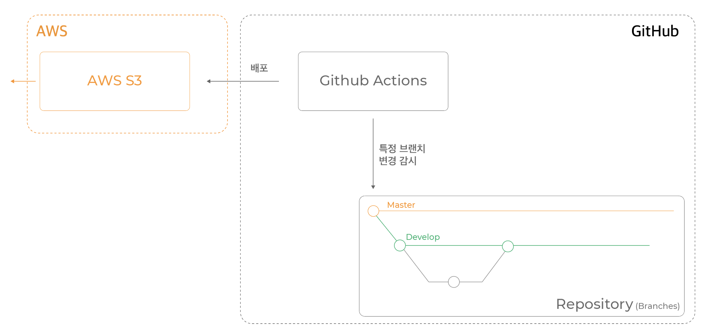

# S3 연동

1. AWS IAM 발급
2. Github Secret 설정
3. Github Actions 설정
4. 잘 되나 테스트해보기

# build pipeline

# Fass

# S3

# 프로비저닝

# 서버리스

- 내부적으로 CloudFormation을 사용하여 API gateway에서 api변동사항을 더욱 쉽게 반영해줄 수 있다.

# 방법

## 1.lamda 함수를 정의한다

## 2. API Gateway와 연동한다.

Trigger를 지정해줘야만 제대로 된 Lambda 함수로서 기능할 수 있다. 설정할 수 있는 Trigger로는 다양한 종류가 있지만 가장 흔히 사용되는 것이 API Gateway

## APEX

- https://hyunseob.github.io/2017/07/09/aws-lambda-with-apex/
- [serverless framework](https://www.serverless.com/)
- [벨로퍼트-서버리스](https://velopert.com/3549)

## npm모듈 사용하기.

2가지 선택지가 있다

1. zip파일을 업로드하기
2. S3에서 파일을 불러오기
