# flex

## intro

CSS3에 나온 속성, 수평이나 수직 정렬에 관련된 속성.  
레이아웃을 구성할 때 가장 많이 사용되는 요소들이 기본적으로 블록 개념으로 표시되며 이는 뷰에 수직을 쌓이기 때문에 수직 구성은 상대적으로 쉽게 만들 수 있다. 하지=만 수평구성은 상황이 다르다.  
FLEX는 요소의 크기가 불분명하거나 동적인 경우에도 각 요소를 정렬할 수 있는 효율적인 방법을 제공한다.

FLEX는 2개의 개념으로 나뉜다.
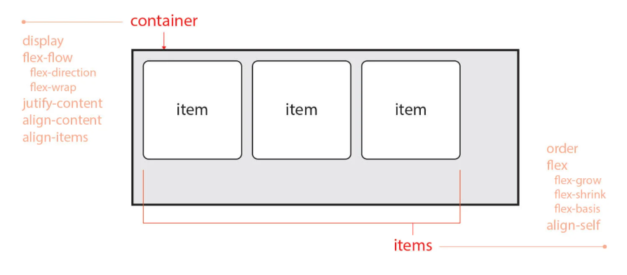

1. container
   - items를 감싸는 부모요소
   - 각 item을 정렬하기 위해선 컨테이너가 필수다.
   - display, flex-flow, justify-content, align-content, align-items, flex-direction, flex-wrap
2. items
   - oder, flex, aling-slef, flex-grow, flex-shrink, flex-basis

```html
<div class="container">
  <div class="item"></div>
  <div class="item"></div>
  <div class="item"></div>
</div>
```

```css
.container {
  border: 2px solid red;
  display: flex;
}

.container .item {
  width: 100px;
  height: 100px;
  border: 2px solid;
  border-radius: 10px;
}
```

## 1. Flex Continer

주축(main-axis)과 교차 축(cross-axis)

### 1.1 display

Flex Continer를 정의한다.

- `display: flex`: 블럭요소처럼 사용된다.
- `display: inline-flex`: 컨테이너 자체가 인라인처럼 왼쪽에서 오른쪽으로 쌓인다.

```html
<div clas="container">
  <div class="item"></div>
  <div class="item"></div>
  <div class="item"></div>
</div>
<div clas="container">
  <div class="item"></div>
  <div class="item"></div>
  <div class="item"></div>
</div>
<div clas="container">
  <div class="item"></div>
  <div class="item"></div>
  <div class="item"></div>
</div>
```

```css
.container {
  border: 2px solid red;
  display: inline-flex;
}

.container .item {
  width: 100px;
  height: 100px;
  border: 2px solid;
  border-radius: 10px;
}
```

### 1.2 flex-flow

items의 주축을 설정하고 items의 여러 줄 묶음도 설정한다.  
flex-direction과 flex-wrap의 단축 속성이다.  
첫번째가 flex-direction이고 flex-wrap속성입니다.

```css
.container {
  flex-flow: row wrap;
}
```

### 1.2 flex-direction

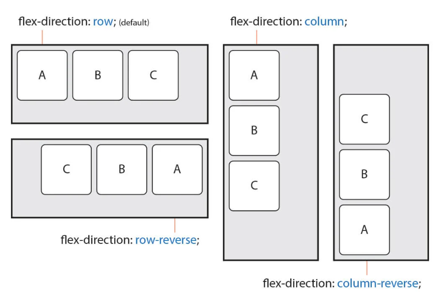

- 주 축을 설정한다.
- row: items를 수평축으로 표시한다.(수평정렬)
- row-reverse: items를 row반대 축으로 표시한다.
- column: Items를 수직축으로 표시 (수직정렬)
- column-revers: Items를 comlumn의 반대 축으로 표시

#### 주 축(main-axis)과 교차 축(cross-axis)

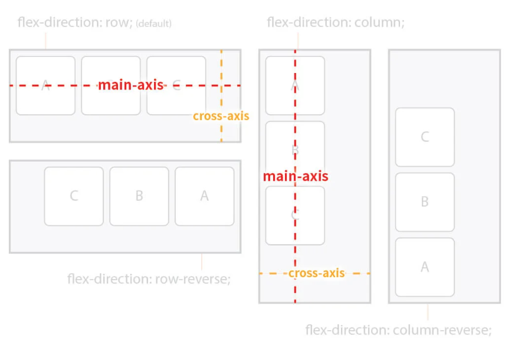
row는 items를 수평축으로 표시하므로 이때는 주 축이 수평이며 교차 축은 수직이된다.
column은 items를 수직축으로 표시하므로 주 축은 수직이며 교차 축은 수평이 된다.  
즉 방향에 따라 주 축과 교차 축이 달라진다.

#### 시작점 (flex-start)과 끝점(flex)

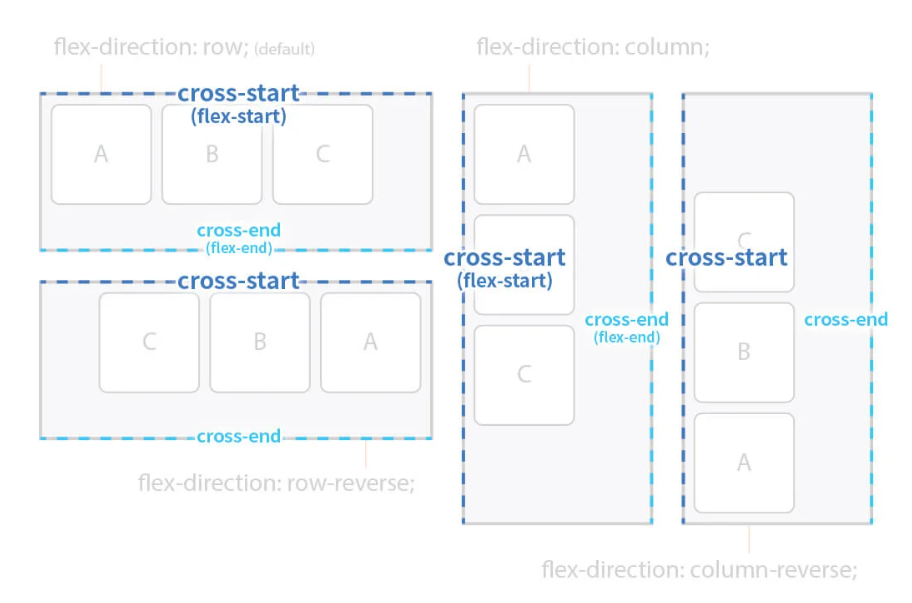
주 축이나 교차 축의 시작하는 지점과 끝나는 지점을 지칭한다.  
flex-direction에 따라 시작점과 끝점이 달라진다.  
상,하, 좌,우 중 시작점을 기점으로 그 반대가 끝점이라 생각하면 된다.

- 왼쪽에서 오른쪽이 기본
- 위에서 아래가 기본이다.

- 교차축은 reverse값에 따라 달라지지 않는다.

### 1.3 flex-wrap

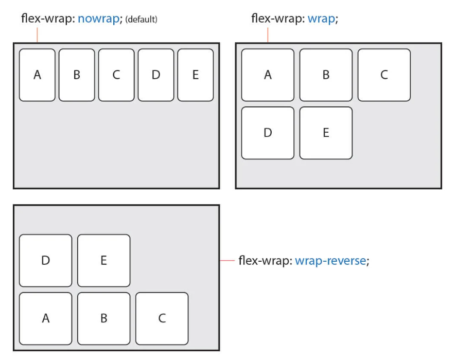

- items의 여러 줄 묶음(줄 바꿈)을 설정한다.
- flex는 기본값이 nowrap으로 모든 인덱스를 컨테이너 안에서 한줄로 표시한다. 여러줄로 표현이 필요한 경우 이 속성을 수정해야한다.
- 한줄로 표현이 되기 때문에 모든 요소의 Width값의 합이 컨테이너의 너비보다 클경우 비율에 맞게 줄어든다.
- `flex-wrap:wrap;`을 해야지 컨테이너 너비가 좁을 경우 개행된다.

**속성**

- nowrap: 한줄로 표시, 묶지 않음
- wrap: 여러 줄로 묶음
- wrap: 역 방향으로 묶음

```html
<div class="container">
  <div class="item">A</div>
  <div class="item">B</div>
  <div class="item">C</div>
  <div class="item">D</div>
  <div class="item">E</div>
</div>
```

```css
.container {
  border: 4px solid;
  display: flex;
  flex-wrap: wrap;
}
.container .item {
  width: 150px;
  height: 100px;
  background: tomato;
}
```

각각의 아이템이 `flex-basic`가 기본값으로 들어가는데 이러면 너비값이 가변값이 된다.

### 1.4 justify-content

주 축의 정렬 방법을 설정한다.

- flex-start: 시작점으로 정렬
- flex-end: items를 끝점으로 정렬
- center: items를 가운데 정렬
- space-between: 시작 Item은 시작점에 마지막 Item은 끝범에 정렬되고 나머지 Item는 사이에 고르게 정렬됨
- space-around: item를 균동한 여백을 포함시켜 정렬

```html
<div class="container">
  <div class="item">A</div>
  <div class="item">B</div>
  <div class="item">C</div>
  <div class="item">D</div>
</div>
```

```css
.container{
    border: 4px solid;
    display: flex;
    justify-content: center
    flex-wrap: wrap;
}
.container .item{
    width: 100px;
    height: 100px;
    background: tomato;
    border: 4px dashed red;
    border-radius: 10px;
}
```

### 1.5 align-content

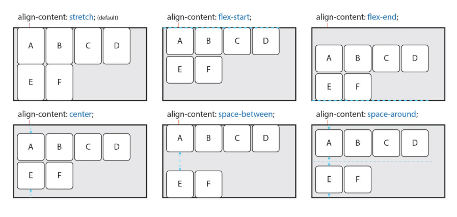

교차축에서 items의 정렬 방법을 설정한다.

- `align-content`은 교차축의 시작지점과 끝지점을 기준으로 사고한다.
- 여러줄이면서 컨테이너의 높이가 고정되어 여백 아이템간의 여백이 있는 상황에서 사용된다.

- strecth: Container의 교차 축을 채우기 위해 Items를 늘린다.
- flex-start: Items를 시작점으로 정렬한다.
- flex-end: Items를 끝점으로 정렬
- center: items를 가운데 정렬
- space-between: 시작 item은 시작점에 마지막 item은 끝점에 정렬되고 나머지 tiems는 사이에 고르게 정렬됨
- space-around: items를 균등한 여백을 포함하여 정렬

```html
<div class="container">
  <div class="item">A</div>
  <div class="item">B</div>
  <div class="item">C</div>
  <div class="item">D</div>
  <div class="item">E</div>
  <div class="item">F</div>
</div>
```

```css
.container {
  height: 400px;
  border: 4px solid;
  display: flex;
  flex-wrap: wrap;
  align-content: stretch;
  justify-content: center;
}
.container .item {
  width: 120px;
  height: auto;
  background: tomato;
  border: 4px dashed red;
  border-radius: 10px;
}
```

### 1.6 align-items

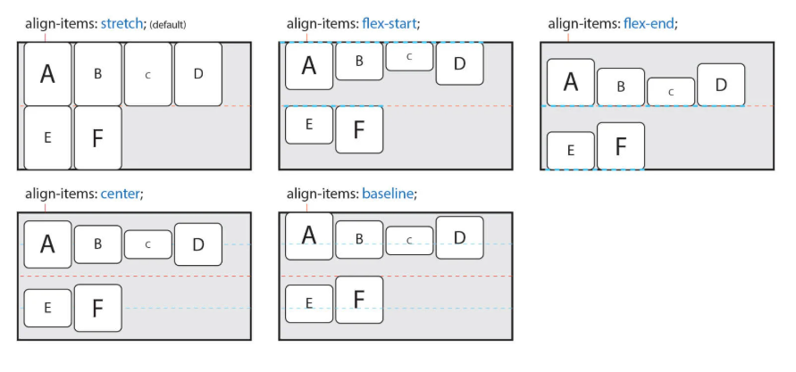
교차 축에서 items의 정렬 방법을 설정한다.  
items가 한 줄일 경우 많이 사용된다.

- 각 줄이 시작 지점과 끝지점이 다르다는 것을 주의한다.
- A요소와 F요소의 시작점과 끝지점이 다르다.
- 아이템이 한줄일 경우에는 `align-content`속성이 적용된다.
- baseline은 문제의 아랫부분을 기준으로 요소를 정렬한다.

* stretch : Container의 교차 축을 채우기 위해 items를 늘림
* flex-start: Items를 각 줄의 시작점으로 정렬
* flex-end: Items를 각 줄의 끝점으로 정렬
* center: Items를 가운데 정렬
* baseline: Items를 문자 기준선에서 정렬

```html
<div class="container">
  <div class="item">A</div>
  <div class="item">B</div>
  <div class="item">C</div>
  <div class="item">D</div>
  <div class="item">E</div>
  <div class="item">F</div>
</div>
```

```css
.container {
  border: 4px solid;
  display: flex;
  flex-wrap: wrap;
  align-content: stretch;
  justify-content: center;
  height: 400px;
  align-items: stretch;
}
.container .item {
  width: 120px;
  height: 100px;
  background: tomato;
  border: 4px dashed red;
  border-radius: 10px;
  font-size: 30px;

  /* 내부 텍스트 중앙정렬 */
  display: flex;
  justify-content: center;
  align-items: center;
}

/* .container .item:nth-child(3){
    font-size: 50px;
} */
```

- 아이템 내부의 텍스트를 중앙에 정렬하는 방법
- 아이템을 플랙시블박스로 만들고 jsutify-content와 align-items를 적용함

---

## 2.Flex Items

### 2.1 order

flex item의 순서를 설정  
숫자를 지정하고 숫자가 클수록 숫자가 밀린다. 음수 가능
HTML 구조와 상관없이 순서를 변경할 수 있어 유용하다.

```html
<div class="container">
  <div class="item item1">A</div>
  <div class="item item2">B</div>
  <div class="item item3">C</div>
  <div class="item item4">D</div>
  <div class="item item5">E</div>
  <div class="item item6">F</div>
</div>
```

```css
.container {
  border: 4px solid;
}

.container .item {
  width: 100px;
  height: 100px;
  background: tomato;
  border: 4px dashed red;
  border-radius: 10px;
  font-size: 30px;
  display: flex;
  justify-content: center;
  align-items: center;
}

.item1 {
  order: 1;
}

.item4 {
  order: 1;
}

.item6 {
  order: -1;
}
```

### 2.2 flex-grow

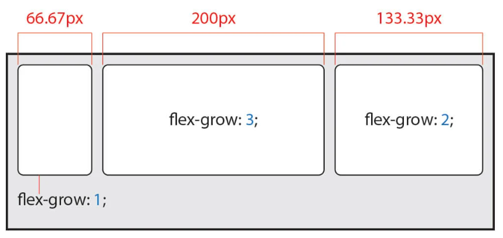
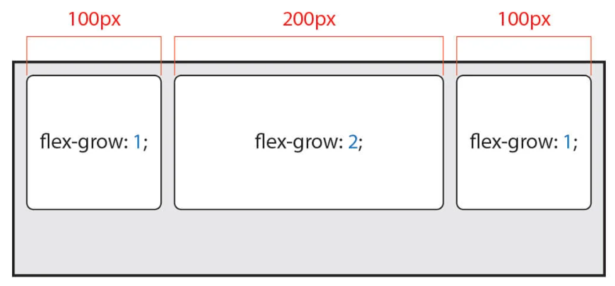

Flex item의 증가 너비 비율을 설정  
숫자가 크면 더 많은 너비를 가진다.
Item이 가변 넘비가 아니거나 값이 0일 경우 효과가 없다.  
레이아웃을 설정할 수 있다.

- 이 속성에서 전체의 비율은 가용가능한 너비가 된다.
- 만약 다른 요소에 width값이고정 수치로 지정되어있다면 이 너비는 최소값으로 보존된다.
- 가변값 설정을 통해 반응형웹에 사용할 수 있는 속성.
- 이때 비율은 전체너비를 기준으로 하여 계산된다.
- 계산된 너비는 최대너비로 적용된다 이 말은 다른 요소에 의해 최대너비만큼 요소를 늘리지 못할 경우에 계산된 너비보다 작아질 수 있다는 얘기다.
- 요소간의 비율을 설정할때 사용하는 속성이다.
- 이때 요소간 Width값이 고정되어있으면 flex-grow로 정확한 비율을 나눠지지 않는다.
- 사이드바를 쉽게 구현할 수 있다.

```html
<div class="container">
  <div class="item item1">A</div>
  <div class="item item2">B</div>
  <div class="item item3">C</div>
</div>
```

```css
.container {
  border: 4px solid;
  display: flex;
}

.container .item {
  height: 100px;
  background: tomato;
  border: 4px dashed red;
  border-radius: 10px;
}

.item1 {
  flex-grow: 1;
}

.item2 {
  flex-grow: 1;
}
.item3 {
  width: 100px;
}
```

**사이드바 예제**

- 가변역역, 고정영역 만들기.
- 가변영역에 flex-grow를 설정하면된다.
- 고정영역에는 고정 너비를 지정한다.

```html
<div class="container">
  <div class="item item1">A</div>
  <div class="item item2">B</div>
</div>
```

```css
.container {
  border: 4px solid;
  display: flex;
}

.container .item {
  height: 100px;
  background: tomato;
  border: 4px dashed red;
  border-radius: 10px;
}

.item1 {
  flex-grow: 1;
}

.item2 {
  width: 100px;
}
```

item2는 고정된 너비를 보장받고 item1는 가변영역으로 나머지 모든 공간을 할당받는다.  
고정영역과 가변영역을 설정하기 쉽다.

### 2.3 flex-shrink

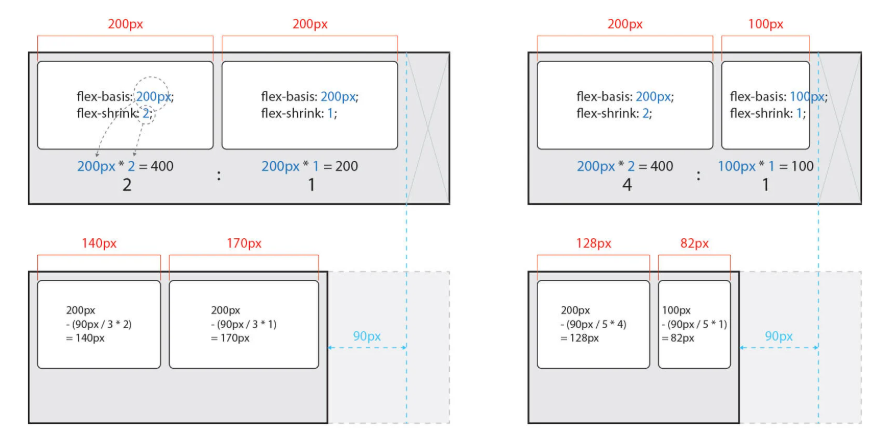

Flex item의 감소 너비 비율을 설정  
숫자가 크면 더 많은 너비가 감소한다.  
item이 가변 너비가 아니거나, 값이 0일 경우 효과가 없다.

- 아이템이 고정너비를 가지고 있을 때 감소가 되는 값을 계산해야한다.

### 2.4 flex-basis

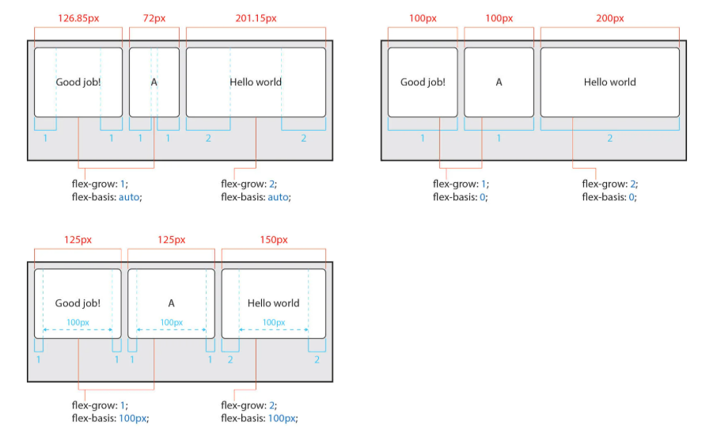

Flex item의 기본 너비 설정  
ITEM의 (공간 배분 전) 기본 너비를 설정한다.  
값이 auto일 경우 width, height 등의 속성으로 Item의 너비를 설정할 수 있다.  
하지만 단위 값이 주어질 겨우 설정할 수 없다.

- flex-basis가 auto이면 컨텐츠의 너비가 보존된다.
- flex-basis를 0으로 설정하면 컨텐츠의 너비상관없이 flex-grow에 설정한 비율이 적용된다.
- flex-grow를 지정할때 기본너비를 설정할 수 있다.

- auto: 가변 Item같은 너비
- 단위: px, em,cm등 단위로 지정한다.
- 기본값은 auto
- 기본 너비를 0으로 설정하면 모든 영역이 공간 배분 대상이 된다.

```html
<div class="container">
  <div class="item item1">Godd job!</div>
  <div class="item item2">A</div>
  <div class="item item3">Hello world~~</div>
</div>
```

```css
.container {
  border: 4px solid;
  display: flex;
}

.container {
  height: 100px;
  background: tomato;
  border: 4px dashed red;
  border-radius: 10px;
  flex-grow: 1;
  flex-basis: 100px;
}

.container .item {
  flex-grow: 2;
}
```

### 2.5 Flex

flex-grow, flex-shirnk, flex-basis의 단축 속성

- flex-grow: Item의 증가 너비 비율을 설정, 기본값 0
- flex-shirnk: Item의 감소 너비 비율을 설정, 기본값 1
- flex-basis: Item의 증가 공간 배분 전 기본너비 설정, auto

```
flex: 증가너비 감소너비 기본너비;
```

단축속성을 사용할때 3번째 값은 기본너비(flex-basis)를 의미하는데  
속성을 2개만 입력했을 경우 기본너비의 값은 0으로 적용된다.  
flext-basis의 기본값이 auto인것과 헷깔리면 안된다.

### 2.6 align-self

교차 축에서 Item의 정렬 방법을 설정  
align-items는 Container 내 모든 Items의 정렬 방법을 설정한다.  
필요에 의해 일부 item만 정렬 방법을 변경하려고 할 경우 align-seldf를 사용할 수 있다  
이 속성은 align-items 속성보다 우선한다.

- auto: Container의 algin-items속성을 상속받음
- stretch: container의 교차 축을채우기 위해 Item을 늘림
- flex-start: Item을 줄의 시작점으로 정렬
- flex-end: Item을 줄의 끝점 정렬
- center: item을 가운데 정렬
- baseline: item을 문자 기준선에 정렬

```html
<div class="container">
  <div class="item item1">1</div>
  <div class="item item2">2</div>
  <div class="item item3">3</div>
  <div class="item item4">4</div>
  <div class="item item5">5</div>
  <div class="item item6">6</div>
  <div class="item item7">7</div>
  <div class="item item8">8</div>
</div>
```

```css
.container {
  border: 4px solid;
  display: flex;
  flex-wrap: wrap;
  align-items: flex-end;
}

.container {
  width: 100px;
  height: 100px;
  background: tomato;
  border: 4px dashed red;
  border-radius: 10px;
}

.container .item {
  flex-grow: 2;
}

.container .item2 {
  align-self: center;
}

.container .item4 {
  align-self: center;
}

.container .item7 {
  align-self: stretch;
  height: auto;w
}
```

## REF

- [FLEX1](https://heropy.blog/2018/11/24/css-flexible-box/)
- [FLEX2](https://d2.naver.com/helloworld/8540176)
- [FLEX3](https://poiemaweb.com/css3-flexbox)
