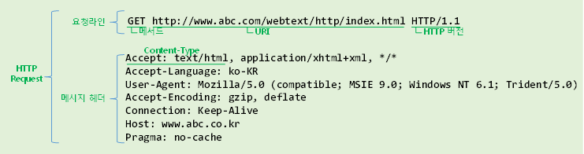
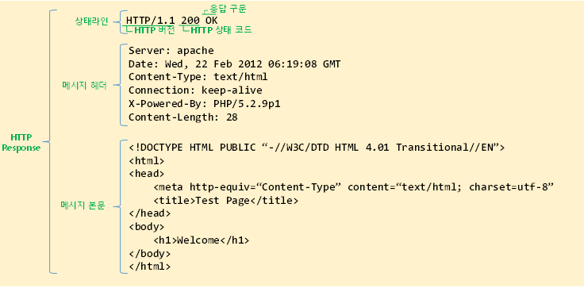

# HTTP

## 1.정의
- Hyper Text Transfer Protocol
- 인터넷에서 데이터를 주고받는 통신규약
- 통신에서 정규화된 포맷을 약속한것이 HTTP이다.

## 2. HTTP 메시지
 HTTP 메시지는 HTTP 애플리케이션 간에 주고받는 데이터.
 Request(요청), Response(응답).
 - 시작줄
 - 헤더
 - 본문

### 2.1 Request

#### 2.1.1 요청라인

    메서드 : GET, HEAD, POST, PUT, TRACE, DELETE
    URL : /login.do
    버전 : 1.1

#### 2.1.2 헤더

### 3.1 Response

#### 3.1.1 요청라인

    메서드 : GET, HEAD, POST, PUT, TRACE, DELETE
    URL : /login.do
    버전 : 1.1

#### 3.1.2 헤더

#### 3.1.3 본문

    

## 3.참고
- 그림으로배우는HTTP & Network

## 4.다음에...
- https
- http2.0
- TCP/IP 계층

