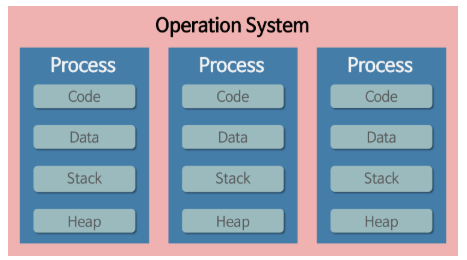
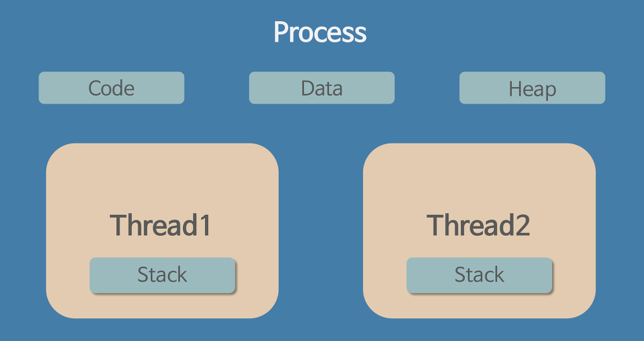

## Process

프로세스는 운영체제가 메모리 등의 필요한 자원을 할당해준 실행 중인 프로그램이다. 프로그램을 실행하면 운영체제로부터 실행에 필요한 자원을 할당받아 프로세스가 된다. 이때, 각각의 프로세스는 서로 메모리 공간을 독자적으로 갖기 때문에 서로 메모리 공간을 공유하지 못한다. 따라서 다른 프로세스의 메모리에 접근하려면 IPC(InterProcess Communication)과 같은 방식이 필요하다. 프로세스는 하나 이상의 스레드를 포함한다.

### 프로세스의 구조

- stack : 데이터를 일시적으로 저장하는 영역, 지역변수 사용(malloc, new를 사용했을 때 변수가 있는 공간), 변수가 범위 밖으로 이동하면 공간 해제
- heap : 코드 영역과는 별도로 유지되는 자유 영역, 동적으로 메모리 할당(malloc, new를 사용했을 때 실제 객체가 있는 공간)
- code/text : 실행 명령어를 포함하는 메모리이거나 목적 파일에 있는 프로그램 영역,

### 프로세스 제어 블록(Process Control Block, PCB)
PCB는 특정 프로세스에 대한 중요한 정보를 저장하고 있는 운영체제의 자료구조입니다. 운영체제는 프로세스를 관리하기 위해 프로세스의 생성과 동시에 고유한 PCB를 생성합니다. 프로세스는 CPU를 할당 받아 작업을 처리하다가도 프로세스 전환이 발생하면 진행하던 작업을 저장하고 CPU를 반환해야 합니다. 이 때 작업의 진행 상황을 모두 PCB에 저장하게 됩니다. 그리고 다시 CPU의 할당을 받게 되면 PCB에 저장되어있던 내용을 불러와 이전에 종료됐던 시점부터 다시 작업을 수행합니다.

PCB에 저장되는 정보
- 프로세스 식별자(Process ID, PID) : 프로세스 식별번호
- 프로세스 상태 : new, ready, running, watiting, terminated 등의 상태를 저장
- 프로그램 카운터 : 프로세스가 다음에 실행할 명령어의 주소
- CPU 레지스터
- CPU 스케쥴링 정보 : 프로세스의 우선순위, 스케줄 큐에 대한 포인터 등
- 메모리 관리 정보 : 페이지 테이블 또는 세그먼트 테이블 등과 같은 정보를 포함
- 입출력 상태 정보 : 프로세스에 할당된 입출력 장치들과 열린 파일 목록
- 어카운팅 정보 : 사용된 CPU 시간, 시간제한, 계정번호 등

## Thred
- 스레드는 프로세스가 할당받은 자원을 이용하는 실행의 단위
- 스레드는 공통적인 제어 흐름을 가지지 않으면서
한 프로세스 내에서 동작하는 여러 실행 흐름이며,
프로세스 내의 자원들을 서로 공유합니다.
- 스레드는 한 프로세스 내에서 동작되는 여러 실행의 흐름으로, 프로세스 내의 주소 공간이나 자원들을 같은 프로세스 내의 스레드끼리 공유하며 실행된다

### 장점
- 시스템의 처리량이 향상된다.  
- 시스템의 자원 소모가 줄어든다  
- 프로그램의 응답 시간이 단축된다.  
- 프로세스 간 통신 방법에 비해 스레드 간의 통신 방법이 훨씬 간단하다.

### 단점
- 여러 개의 스레드를 이용하는 프로그램을 작성하는 경우에는 크리티컬 섹션을 잘 관리하여 여러 스레드가 함께 공유 자원을 이용하는데 오류가 없도록 해야한다.

- 프로그램 디버깅이 어렵다.

- 단일 프로세서 시스템에서는 효과를 기대하기 어렵다

### 스레드의 구조

### 스택을 스레드마다 독립적으로 할당하는 이유
스택은 함수 호출 시 전달되는 인자, 되돌아갈 주소값 및 함수 내에서 선언하는 변수 등을 저장하기 위해 사용되는 메모리 공간입니다. 스택 메모리 공간이 독립적이라는 것은 독립적인 함수 호출이 가능하다는 것이고, 독립적인 실행 흐름이 추가되는 것입니다.

따라서 스레드의 정의에 따라 독립적인 실행 흐름을 추가하기 위한 최소 조건으로 독립된 스택을 할당합니다.

### PC Register를 스레드마다 독립적으로 할당하는 이유
PC 값은 스레드가 명령어의 어디까지 수행했는지를 나타냅니다. 스레드는 CPU를 할당받았다가 스케줄러에 의해 다시 선점당합니다. 그렇기 때문에 명령어가 연속적으로 수행되지 못하고 어느 부분까지 수행했는지 기억할 필요가 있습니다. 따라서 PC 레지스터를 독립적으로 할당합니다.

프로세스 내에서 실행되는 각각의 일을 스레드라고 한다. 프로세스 내에서 실행되는 세부 작업 단위로 여러 개의 스레드가 하나의 프로세스를 이루게 되는 것이다. 스레드는 프로세스 내에서 프로세스의 자원을 이용해서 실제로 작업을 수행하는 일꾼이다. 스레드가 소속된 프로세스가 운영체제로부터 자원을 할당받으면 그 자원을 스레드가 사용한다. 각 스레드는 독자적인 스택(Stack) 메모리를 갖는다. 스레드는 메모리를 공유하기 때문에 동기화, 데드락 등의 문제가 발생 할 수 있다. 

### Muti Thred
프로세스 내 스레드를 여러 개 생성하여 구현하는 것이 훨씬 경제적임

1. 자원 효율성 증대
    - 멀티 프로세스로 실행되는 작업을 멀티 쓰레드로 실행할 경우 프로세스를 생성하여 자원을 할당하는 시스템 콜이 줄어들어 자원을 효율적으로 관리할 수 있다.
    - 프로세스 간의 Context Switching시 단순히 CPU레지스터 교체 뿐마 아니라 RAM과 CPU사이의 캐ㅜ시 메모리에 대한 데이터까지 초기화되므로 오버헤드가 크다.  
    - 쓰레드는 프로세스 내의 메모리를 공유하기 때무에 독립적인 프로세스와 달리 쓰레드 간 데이터를 주고 받는 것이 간단해지고 시스템 자원 소모가 줄어들게 된다.  
2. 처리비용 감소 및 응답 시간 단축
    - 프로세스 간의 통신보다 쓰레드 간의 통신비용이 적으므로 작업들 간의 통신의 부담이 줄어든다.
    - 쓰레드는 Stack영역을 제외한 모든 메모리를 공유한다.
    - 프로세스 간의 전환 속도보다 쓰레드 간의 전환 속도가 빠르다.
    - Context Switching시 쓰레드는 Stack영역만 처리하기 때문이다.  

단점  
- 동기화 문제
- 쓰레드 간의 자원 공유는 전역 변수(데이터 세그먼트)를 이용하므로 함께 사용할 때 충돌이 발생할 수 있다.

## Multi Process VS Multi Thred
- Multi 프로세스에서 각 프로세스들은 다른 프로세스와 독립적으로 실행
- Multi 스레드에서 스레드는 프로세스의 직접 실행 정보를 제외한 나머지 프로세스 관리 정보를 공유하며 실행
    - 하나의 공유 객체를 스레드끼리 사용하며 동작의 효율성을 향상시킬수 있다.
- 스레드는 프로세스 내에서 각각의 스택 공간을 제외한 나머지 공간과 시스템 자원을 공유한다.그러므로 프로세스를 이용하여 동시에 처리하던 일을 스레드로 구현할 경우 메모리 공간은 물론 시스템 자원 소모도 현격히 줄어들게 된다.

프로세스는 운영체제로부터 자원을 할당받는다. 각 작업(Task)마다 운영체제로부터 자원을 할당받기 위해 시스템 콜(Call)을 하는 부담이 생긴다. 멀티 스레드를 사용한다면 시스템 콜(call)을 한번만 해도 되기 때문에 효율적이다. 또한 IPC 방식보다는 스레드 간 통신이 덜 복잡하고 시스템 자원 사용이 더 적으므로 통신의 부담도 줄일 수 있다. 스레드 간 동기화 문제가 생겨 개발자가 신경써야 하는 단점이 있지만 작업(Task)의 비용을 줄인다는 장점이 있다.

## ref
- https://juyoung-1008.tistory.com/47
-  https://www.crocus.co.kr/1403 
-  https://shoark7.github.io/programming/knowledge/difference-between-process-and-thread
- https://gmlwjd9405.github.io/2018/09/14/process-vs-thread.html