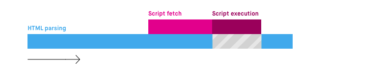
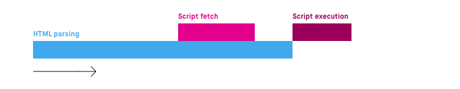

# Script Tag

## intro
어디에 위치해야할까??
->body태그 최하단.


## why?
1. HTML을 읽는 과정에 스크립트를 만나면 중단 시점이 생기고 그만큼 Display에 표시되는 것이 지연된다.
2. DOM 트리가 생성되기전에 자바스크립트가 생성되지도 않은 DOM의 조작을 시도할 수 있다

## 로딩순서 제어하기

### 1. async

- script 로드가 비동기로 이뤄져서 domparsing이 멈추지 않는다.
- script 로드가 끝나면 실행을 하는데 이때는 dom parsing이 멈춘다.
- script 태그를 만나도 html parsing이 중단되지 않습니다. script 로드와 html parsing이 함께 이루어지다가 script 로드가 끝나면 script가 실행되는 시점에 html parsing이 잠시 중단되고 실행이 끝나면 html parsing이 재개됩니다.

```html
<script async src="script.js">
```

### 2. defer

- script로드 시점을 dom parsing이후로 미룬다.
- script 태그를 만나도 script 로드의 시작부터 끝까지 html parsing이 중단되지 않으며 html parsing이 끝나고 난 뒤에야 script가 실행됩니다.
- dom parsing을 중단하지 않고 parsing이 완료된 뒤에 script로드를 한다.
```html
<script defer src="script.js">
```


### 3. DOMContentLoaded와 window.onload
1. DOMContentLoaded 내부의 코드는 DOM 생성이 끝난 후에 실행
2. onload 내부의 코드는 문서에 포함된 모든 콘텐츠(images, script, css, ...)가 전부 로드된 후에 실행
```html
<!DOCTYPE html>
<html lang="ko">
<head>
    <meta charset="UTF-8">
    <title>DOMContentLoaded</title>
</head>
<body>
    <script>
    	// window.onload가 가장 앞에 위치!
        window.onload = function(){
            console.log("afterwindowload");
            var target = document.querySelector("#test");
            console.log(target);
        }
		// DOMContentLoaded가 두번째에 위치!
        document.addEventListener("DOMContentLoaded", function() {
            console.log("afterdomload");
            var target = document.querySelector('#test');
            console.log(target);
        });
		// 일반 script 코드가 가장 끝에 위치
        console.log("바로시작")
        var target = document.querySelector('#test');
        console.log(target);
    </script>
    <div id="test">test</div>
</body>
</html>
```


## ref
- [script  태그는 어디에 위치해야 할까요?](https://velog.io/@takeknowledge/script-%ED%83%9C%EA%B7%B8%EB%8A%94-%EC%96%B4%EB%94%94%EC%97%90-%EC%9C%84%EC%B9%98%ED%95%B4%EC%95%BC-%ED%95%A0%EA%B9%8C%EC%9A%94)