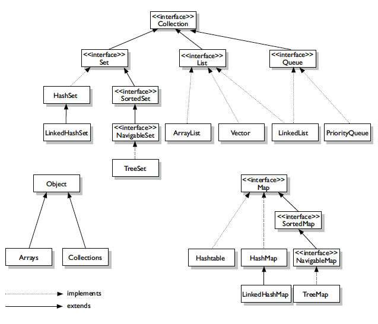

# JCF (JavaCollectionFramework )

Java에서 데이터를 저장하는 기본적인 자료구조들을 한 곳에 모아 관리하고 편하게 사용하기 위해서 제공하는 것을 의미한다. 

## 종류

1. Colllection
    1. List: 순서가 있는 저장공간
        - LinkedList : 양방향 포인터 구조로 데이터 삽입
        - Stack
        - Vector : 동기화 보장
        - ArrayList : 동기화 보장하지 않음
    2. Set : 순서가 없고 데이터 중복할 수 없음.
        - HashSet
        - SortedSet : 정렬을 위한 set
            - TreeSet
2. Map : 키와 값의 쌍으로 이루어진 데이터 집합
    1. Hashtable : 동기화를 보장하는 Map계열의 클래스
    2. HashMap : 동기화를 보장하지 않는 Map
    3. SortedMap :정렬하기 위한 Map
        - TreeMap

### 