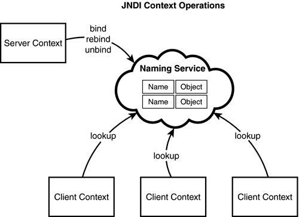

# JNDI

- JNDI(Java Naming and Directory Interface)
- 서비스가 다른 서비스를 탐색할 때 유용하게 사용된다. (분산된 자원)
- 분산된 자원 끼리의 탐색을 원할하게 하기 위한 type casting  (DNS 도 이에 속함) 
- 쉽게 말해 다수의 서로 다른 서비스를 사용하기 위하여, 서로다른 디렉토리 안에 존재하는 객체들을 사용할 수 있게 해주는 API를 모아둔 InterFace. 

- 주로 서로다른 DataBase를 사용하기 위하여 JDBC 드라이버와 함께 사용된다.

- JNDI는 쉽게 말해서 WAS에 공유객체를 저장 후에 가져다 쓰는 방식.
- JNDI DB Pool을 미리 네이밍 시켜둔다.
웹 어플리케이션을 운영 서버로 배포할때 JDBC설정이 달라진다.
- 클래스에 이름을 부여하고 원격으로 접속해서 클래스를 사용할 때 클래스의 다른 이름 역활은 한다.
- 객체를 찾지못하면 javax.naming.NameNotFoundException이 발생한다.
- WAS서버가 부팅시 JNDI 개겣를 등록한다.

## JNDI의 이점
JNDI를 통해 WAS에서 DB source를 설정하는 이점.

### 1.운영상의 의점
웹 애플리케이션과 DB서버 설정을 분리시켜 관리할 수 있다.

### 2.최적화
하나의 was에 하나의 웹 어플리케이션을 올리기도 하지만 대부분 그렇지 않다. 
즉 WAS에 N개의 웹 어플리케이션을 올리는 경우가 일반적이다.
이때 DB연결을 웹 어플리케이션에서 하다면
DB pool이 무조건 N개가 된다. 
유지보수가 어렵고 자원이 낭비된다. 
따라서 WAS에서 설정하는것이 자원 재활용과 유지보수 차원에서 좋다.

### 3.장애대처
장애가 나거나 성능이 정상적이지 못할때 다른 서버가 대신 일을 해주는
failover 기능이다.
예를 들으 DB1에서 장애가 발생하면 백업 DB2로 로드 밸런싱을 한다.
이런 기능들을 was에서 제공한다.

### Connection Pool
- 어플리케이션이 DB에 연결될떄 상당히 많은 시간이 걸린다.
- 따라서 DB접속회수가 많아질 수록 숙도가 느려진다.
- 커넥션풀은 한번 DB와 맺은 연결을 제거하지 않고 다른 쿼리도 사용할 수 있도록 재 활용하는 라이브러리이다.

### JDBC
- DriverManager를 통한 DB 커넥션 객체 생성.
- Connection 객체에서 State객체 생성및쿼리 실행.
- ResultSet 처리
- Connection Close
- JDBC(JAVA DATA BASE Connectivity)
커넥션풀을 만드는것을 쉽게 제공하는것이 JDBC
DataBase에 연결하기 위한 Java Interface

1. 연결
    - conncection Open
2. 객체생성 & 쿼리실행
    - Statement 객체 생성
    - 객체 excute

3. Resultset 조작

4. Connection Close

1,4단계의 열고 다는는 시간을 절약할 수 있다.

### DBCP 
- DBCP(DataBase Connectoin Pool)
- 데이터베이스와 연결되어 있는 객체를 관리하는 Connection Pool
- 데이터베이스와 연결을 종료하지 않고 관리한다.
- 연결된 상태의 Connection을 가지고 있다가 연결이 필요한 곳에 오픈된 커넥슨을 사용할 수 있도록 할당해주고 작업이 다시 끝나면 풀에서 관리하는것을 커넥션풀이라 한다.

### NAIMING 서비스의 종류
- LDAP(LightWeight Directory Access Protocol)
- DNS (Domain Name System)
- 인터넷 네이밍 시스템, 컴퓨터 이름을 IP주소로 변환
- 대규모 분산 데이터 베이스 서버
- NIS(Network Information Stystem)
- CosNaming
- 코바 응용프로그래밍을 위한 네이밍서비스 지원.

##  참고
- J2EE

