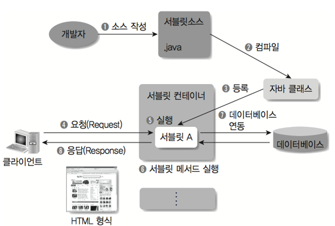

## 1. 정의

    - 요청을 수신하고 작업을 수행하거나 애플리케이션의 다른 부분으로 위임한다.
    - 애플리케이션의 모든 요청은 서블릿을 통한다.
    - HTTP 프로토콜 서비스를 지원하는 javax.servlet.http.HttpServlet 클래스를 상속받는다. 

## 2. LifeCycle

1. 클라이언트의 요청이 들어오면 컨테이너는 해당 서블릿이 메모리에 있는지 확인하고, 없을 경우 init()메소드를 호출하여 적재합니다. init()메소드는 처음 한번만 실행되기 때문에, 서블릿의 쓰레드에서 공통적으로 사용해야하는 것이 있다면 오버라이딩하여 구현하면 됩니다. 실행 중 서블릿이 변경될 경우, 기존 서블릿을 파괴하고 init()을 통해 새로운 내용을 다시 메모리에 적재합니다.

2. init()이 호출된 후 클라이언트의 요청에 따라서 service()메소드를 통해 요청에 대한 응답이 doGet()가 doPost()로 분기됩니다. 이때 서블릿 컨테이너가 클라이언트의 요청이 오면 가장 먼저 처리하는 과정으로 생성된 HttpServletRequest, HttpServletResponse에 의해 request와 response객체가 제공됩니다.

3. 컨테이너가 서블릿에 종료 요청을 하면 destroy()메소드가 호출되는데 마찬가지로 한번만 실행되며, 종료시에 처리해야하는 작업들은 destroy()메소드를 오버라이딩하여 구현하면 됩니다.

## 3. Servlet Container
- 서블릿을 관리해주는 컨테이너
- 클라이언트의 요청을 받아주고 응답을 할 수 있게, 웹서버와 소켓을 만들어 통신한다.

### 3.1 서블릿 컨테이너의 역할
  1. 웹서버와의 통신 지원
서블릿 컨테이너는 서블릿과 웹서버가 손쉽게 통신할 수 있게 해줍니다. 일반적으로 우리는 소켓을 만들고 listen, 
accept 등을 해야하지만 서블릿 컨테이너는 이러한 기능을 API로 제공하여 복잡한 과정을 생략할 수 있게 해줍니다.
그래서 개발자가 서블릿에 구현해야 할 비지니스 로직에 대해서만 초점을 두게끔 도와줍니다.

  2. 서블릿 생명주기(Life Cycle) 관리 
서블릿 컨테이너는 서블릿의 탄생과 죽음을 관리합니다. 서블릿 클래스를 로딩하여 인스턴스화하고, 
초기화 메소드를 호출하고, 요청이 들어오면 적절한 서블릿 메소드를 호출합니다. 
또한 서블릿이 생명을 다 한 순간에는 적절하게 Garbage Collection(가비지 컬렉션)을 진행하여 편의를 제공합니다.

  3. 멀티쓰레드 지원 및 관리 
서블릿 컨테이너는 요청이 올 때 마다 새로운 자바 쓰레드를 하나 생성하는데, HTTP 서비스 메소드를
실행하고 나면, 쓰레드는 자동으로 죽게됩니다. 원래는 쓰레드를 관리해야 하지만 서버가 다중 쓰레드를
생성 및 운영해주니 쓰레드의 안정성에 대해서 걱정하지 않아도 됩니다.

  4. 선언적인 보안 관리 
서블릿 컨테이너를 사용하면 개발자는 보안에 관련된 내용을 서블릿 또는 자바 클래스에 구현해 놓지 않아도 됩니다.
일반적으로 보안관리는 XML 배포 서술자에 다가 기록하므로, 보안에 대해 수정할 일이 생겨도 자바 소스 코드를 
수정하여 다시 컴파일 하지 않아도 보안관리가 가능합니다.
 