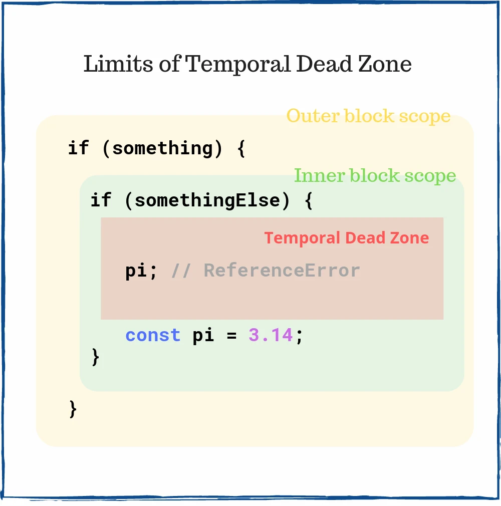

# Temporal Dead Zone


## TL;DR
- TDZ은 초기화 이전에 접근이 불가능한 영역을 말한다.
- TDZ는 선언 전에 변수를 사용하는 것을 허용하지 않는다.
- TDZ는 좋은 코딩습관을 유도한다.

## intro

    ReferenceError: Cannot access 'white' before initialization 


## 영향을 받는 구문

1. const


2. let


3. class

4.  constructor() 내부의 super()
```js
class Car {

    constructor(color){
        this.color = color;
    }
}


class MuscleCar extends Car {
    constructor(color, power) {
      this.power = power;
      super(color);
    }
  }

const myCar = new MuscleCar('blue', '300HP')
// Must call super constructor in derived class before accessing 'this' or returning from derived constructor
```


5. 기본 함수 매개변수(Default Function Parameter)

```js
const a = 2;        // (1)
function square(a = a) {
  return a * a;
}
// Does not work!
square(); // throws `ReferenceError`
```
이 경우 기본값으로 사용된 a가 (1)의 `const a = 2;`가 아니라 매개변수로 선언된 a를 의미한다 즉 초기화가 안된 상태에서 사용을 했기 때문에 오류가 난다.  


```js
const init = 2;
function square(a = init) {
  return a * a;
}
// Works!
square(); // => 4
```


## 영향을 받지 않는 구문

1. var 

```js
// Works, but don't do this!
value; // => undefined
var value;

```

2. function

```js
// Works!
greet('World'); // => 'Hello, World!'
function greet(who) {
  return `Hello, ${who}!`;
}

// Works!
greet('Earth'); // => 'Hello, Earth!'
```

3. import

```js
// Works!
myFunction();
import { myFunction } from './myModule';
```

## typeof 연산자

```js
typeof variable; // throws `ReferenceError`
let variable;
```
TDZ에 해당하는 변수들은 typeof를 사용해도 오류가 난다.

상대적으로 TDZ 변수가 아닌값들은 undefined가 된다.
```js
typeof notDefined; // => 'undefined'
```


## TDZ의 범위



## ref
- [toast-TDZ](https://ui.toast.com/weekly-pick/ko_20191014/)