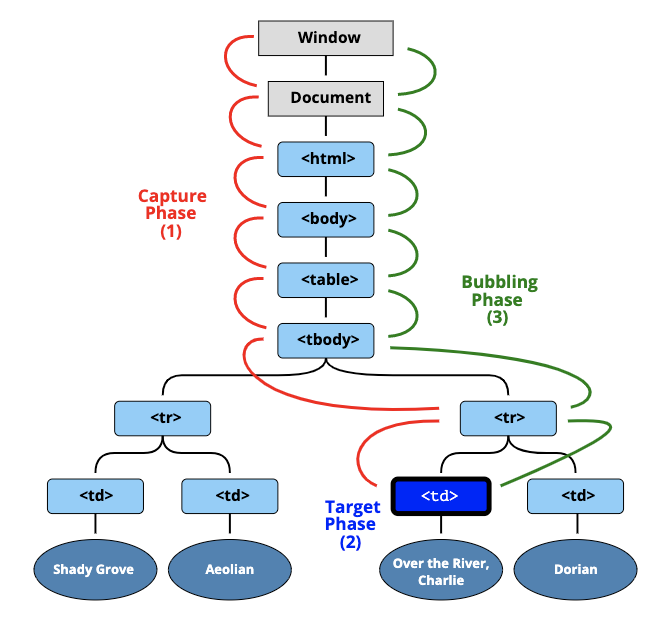

# Event

## intro


이벤트 흐름도

이벤트는 3가지 단계가 있다.

1. capture단계
2. target 단계
3. bubbling단계

이벤트 흐름은 캡처링부터 시작하여 버블링으로 종료한다.  
다시말해 이벤트가 발생했을 때 캡처링과 버블링은 순차적으로 발생한다.


## 1.Evnet Bubbling
이벤트 버블링은 특정 화면 요소에서 이벤트가 발생했을 때 해당 이벤트가 더 상위의 화면 요소들로 전달되어 가는 특성
- 한 요소에 이벤트가 발생하면, 이 요소에 할당된 핸들러가 동작하고, 이어서 부모 요소의 핸들러가 동작합니다. 가장 최상단의 조상 요소를 만날 때까지 이 과정이 반복되면서 요소 각각에 할당된 핸들러가 동작합니다.

- 브라우저는 특정 화면 요소에서 이벤트가 발생했을 때 그 이벤트를 최상위에 있는 화면 요소까지 이벤트를 전파시킵니다.
- 버블링을 막지 않을 경우에 최종적으로 document까지 전달된다.

```html
<body>
	<div class="one">
		<div class="two">
			<div class="three">
			</div>
		</div>
	</div>
</body>
```

```js
var divs = document.querySelectorAll('div');
divs.forEach(function(div) {
	div.addEventListener('click', logEvent);
});

function logEvent(event) {
	console.log(event.currentTarget.className);
}
```


## 2.Event capturing

	자식 요소에서 발생한 이벤트가 부모 요소부터 시작하여 이벤트를 발생시킨 자식 요소까지 도달하는 것을 캡처링이라 한다

```html
<body>
	<div class="one">
		<div class="two">
			<div class="three">
			</div>
		</div>
	</div>
</body>

```


```js
var divs = document.querySelectorAll('div');
divs.forEach(function(div) {
	div.addEventListener('click', logEvent, {
		capture: true // default 값은 false입니다.
	});
});

function logEvent(event) {
	console.log(event.currentTarget.className);
}


```
addEventListener에 옵션 객체를 전달하여 이벤트 탐색방향이 capture임  
이 경우 thee를 클릭하더라도 결과가
```js
// one
// two
// Three
```
다음과 같이 나옵니다.  
브라우저가 최상위 엘리먼트에서 부터 이벤트를 실행시키기 때문입니다.  


## 3.stopPropagation


이벤트 전파 흐름에서 해당 이벤트가 다음요소로 전파되는것을 막는다.  

1. capturing 단계에서 실행
	- 다음 자식요소로 전파하는것을 막음.
2. bubbling 단계에서 실행.
	- 다음 부모요소로 전파하는것을 막음.


### 1. Evnet Bubbling
이벤트를 전파하지 않고 클릭한 요소의 이벤트만 발생시킨다.  

```js
// 이벤트 버블링 예제
divs.forEach(function(div) {
	div.addEventListener('click', logEvent);
});

function logEvent(event) {
	event.stopPropagation();
	console.log(event.currentTarget.className); // three
}

```

### 2. evnet capture
클릭한 요소의 최상위 요소에만 이벤트를 동작시키고 하위 요소로 이벤트를 전달하지 않는다.  

```js
// 이벤트 캡쳐 예제
divs.forEach(function(div) {
	div.addEventListener('click', logEvent, {
		capture: true // default 값은 false입니다.
	});
});

function logEvent(event) {
	event.stopPropagation();
	console.log(event.currentTarget.className); // one
}
```


### 3. event.stopPropagation이 문제가 되는 경우
- 이벤트 사용을 통계를 내야하는 경우
- document에서 이벤트를 캐치해야하는 경우.
- 이벤트 버블링을 막아야 하는 경우는 거의 없습니다. 버블링을 막아야 해결되는 문제라면 커스텀 이벤트 등을 사용해 문제를 해결할 수 있습니다. 

1. 중첩 메뉴를 만들었다 가정합시다. 각 서브메뉴(submenu)에 해당하는 요소에서 클릭 이벤트를 처리하도록 하고, 상위 메뉴의 클릭 이벤트 핸들러는 동작하지 않도록 stopPropagation을 적용합니다.
2. 사람들이 페이지에서 어디를 클릭했는지 등의 행동 패턴을 분석하기 위해, window내에서 발생하는 클릭 이벤트 전부를 감지하기로 결정합니다. 분석  시스템을 도입하기로 합니다. 그런데 이런 분석 시스템의 코드는 클릭 이벤트를 감지하기 위해 document.addEventListener('click'…)을 사용합니다.
3. stopPropagation로 버블링을 막아놓은 영역에선 분석 시스템의 코드가 동작하지 않기 때문에, 분석이 제대로 되지 않습니다. 안타깝게도 stopPropagation을 사용한 영역은 '죽은 영역(dead zone)'이 되어버립니다.


**event.stopPropagation대신에 분기처리를 할것!**  
- 핸들러의 event 객체에 데이터를 저장해 다른 핸들러에서 읽을 수 있게 하면, 아래쪽에서 무슨 일이 일어나는지를 부모 요소의 핸들러에게 전달할 수 있으므로, 이 방법으로도 이벤트 버블링을 통제할 수 있습니다.


## 4.Event Delegation
하위 요소에 각각 이벤트를 붙이지 않고 상위 요소에서 하위 요소의 이벤트들을 제어하는 방식

```html
<h1>오늘의 할 일</h1>
<ul class="itemList">
	<li>
		<input type="checkbox" id="item1">
		<label for="item1">이벤트 버블링 학습</label>
	</li>
	<li>
		<input type="checkbox" id="item2">
		<label for="item2">이벤트 캡쳐 학습</label>
	</li>
</ul>
```


```js
var inputs = document.querySelectorAll('input');
inputs.forEach(function(input) {
	input.addEventListener('click', function(event) {
		alert('clicked');
	});
});

// 새 리스트 아이템을 추가하는 코드
var itemList = document.querySelector('.itemList');

var li = document.createElement('li');
var input = document.createElement('input');
var label = document.createElement('label');
var labelText = document.createTextNode('이벤트 위임 학습');

input.setAttribute('type', 'checkbox');
input.setAttribute('id', 'item3');
label.setAttribute('for', 'item3');
label.appendChild(labelText);
li.appendChild(input);
li.appendChild(label);
itemList.appendChild(li);
```
위 예제에서는 새롭게 추가된 목록에는 이벤트 할당이 안되어있다.  
이런 경우 매번 이벤트를 등록해주는 대신에 어떻게 처리할 수 있을까?  
이를 위한 해결방법이 이벤트 위임이다.

이벤트 위임을 하기 위해 우선 input박스가 아닌 ul태그에 이벤트를 부여한다.  
이벤틀 버블링을 이용해서 부모요소에 이벤트를 부여하고 자식요소에서 이벤트를 감지하도록 할 것이다.
```js
var itemList = document.querySelector('.itemList');
itemList.addEventListener('click', function(event) {
	alert('clicked');
});

```

## stopImmediatePropagation
한 요소의 특정 이벤트를 처리하는 핸들러가 여러개인 상황에서, 핸들러 중 하나가 버블링을 멈추더라도 나머지 핸들러는 여전히 동작합니다.

event.stopPropagation()은 위쪽으로 일어나는 버블링은 막아주지만, 다른 핸들러들이 동작하는 건 막지 못합니다.

버블링을 멈추고, 요소에 할당된 다른 핸들러의 동작도 막으려면 event.stopImmediatePropagation()을 사용해야 합니다. 이 메서드를 사용하면 요소에 할당된 특정 이벤트를 처리하는 핸들러 모두가 동작하지 않습니다.

## Event.target
- 이벤트를 발생시킨 최초 타깃(target) 요소, 시발점.
- event.target은 실제로 이벤트가 시작된 ‘타깃’ 요소입니다. 버블링이 진행되어도 변하지 않습니다.
- this(event.crrentTarget)는 ‘현재’ 요소로, 현재 실행 중인 핸들러가 할당된 요소를 참조합니다.

## Event.currentTarget
	이벤트에 바인딩된 DOM 요소를 가리킨다. 즉, addEventListener 앞에 기술된 객체를 가리킨다.


## Event.preventDefault
을 submit하거나 링크를 클릭하면 다른 페이지로 이동하게 된다. 이와 같이 요소가 가지고 있는 기본 동작을 중단시키기 위한 메소드가 preventDefault()이다.
```html
<!DOCTYPE html>
<html>
<body>
  <a href="http://www.google.com">go</a>
  <script>
  document.querySelector('a').addEventListener('click', function (e) {
    console.log(e.target, e.target.nodeName);

    // a 요소의 기본 동작을 중단한다.
    e.preventDefault();
  });
  </script>
</body>
</html>
```

##  preventDefault & stopPropagation
기본 동작의 중단과 버블링 또는 캡처링의 중단을 동시에 실시하는 방법은 아래와 같다.
```js	
return false;
```


## CSS를 이용한 이벤트 제어

```css
.non-events{
    pointer-events: none;
}
```
해당 속성을 추가하면 해당 엘리먼트에 이벤트가 동작하지 않는다.


## REF 
- [이벤트 위임](https://ko.javascript.info/event-delegation)
- [이벤트 흐름](https://poiemaweb.com/js-event)
- [버블링과 캡쳐링](https://ko.javascript.info/bubbling-and-capturing)
- [이벤트 버블](https://joshua1988.github.io/web-development/javascript/event-propagation-delegation/)
- [How to prevent evnet Bubbling?](https://programmingsummaries.tistory.com/313?category=485241)
- [event Bubblingand evnet delegation](https://joshua1988.github.io/web-development/javascript/event-propagation-delegation/)