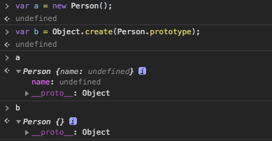
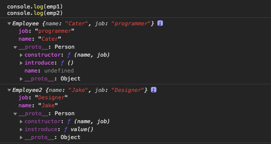
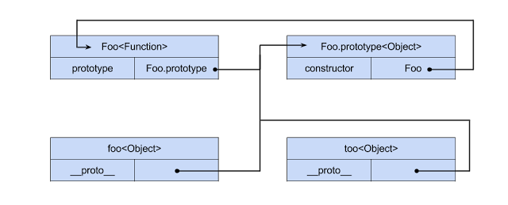

# Prototype_inherit

1. 자식 클래스의 인스턴스는 부모 클래스의 인스턴스이어야한다.
2. 자식 클래스의 속성과 메서드가 부모클래스에 영향을 주며 안된다.
3. 자식 클래스는 부모의 속성과 메서드를 모두 물려받으며 새로운 속성과 메서드를 추가할 수있다.
4. 자식 클래스는 부모 클래스의 메서드를 오버라이드할 수 있다.
5. 인스턴스를 통해 클래스를 확인 가능해야한다.


## 1. 부모 인스턴스에 속성과 메서드를 추가하는 방식.

```js
function Person(name,age){
  this.name = name;
  this.age = age
}

Person.prototype.say = function(){
  console.log("Hi I'm " + this.name)
}

function Employee(name, age, job,career){
  
  var obj = new Person();   //obj의 프로토타입은 Peson

  //덮어쓴다.
  obj.name = name
  obj.age = age
  obj.job = job
  obj.career = career;

  obj.introduce = function(){
    console.log('My job is '+ this.job + "\n")
  }

  return obj;  
}


var worker = new Employee('cater',29,'programer',2)

console.log('worker is instance of Employee ', worker instanceof Employee)    //false
console.log('worker is instance of Person ', worker instanceof Person)    // true
console.log(Object.getPrototypeOf(worker))

worker.say()
worker.introduce()
```
가장 초기에 사용했던 상속방법이다. this를 반환하는 대신 새로운 obj를 반환하는 방식으로 상속을 구현했다.  
이 방법의 단점은 worker가 Employee의 인스턴스라는 걸 알 수 없다는 것이다. 이건 객체지향 관점에서 치명적인 점이다.  
부모 클래스의 인스턴스에 속성과 메서드를 추가하기 때문에 introduce같은 메서드를 프로토타입 객체에 등록할 수 없다. 

**미해결**
1. worker가 Employee의 인스턴스라는걸 확인할 수 없음.
2. 부모와 프로토타입 공유.


## 2. prototype 공유 패턴.
```js
/* 
var person_Prototype = {
  name: "anonymous",
  age:"99",
  say: function(){
    console.log("Hi i'm "+ this.name);
}
 */
var Person = function(name,age){
  this.name = name || 'default_name';
  this.age = age || 'default_age';
};

Person.prototype.name = "anonymous";
Person.prototype.age = "-1"
Person.prototype.say = function(){
  console.log("Hi i'm "+ this.name);
}


function Interviewer(name,age, dep, position){
  this.name = name;
  this.age = age;
  this.dep = dep;
  this.position = position;
  this.pass = function(){
    console.log("You are passed")
  }

}

Interviewer.prototype = Person.prototype;


var interviewer = new Interviewer('Jake');;
interviewer.pass();


function Applicant(name,age,major, gender){
  name && (this.name = name);     //(A)
  age && (this.age = age);

  this.major = major;
  this.gender = gender;

  this.introduce = function(){
    console.log('My major is ' + this.major);
  }
}

Applicant.prototype = Person.prototype;


var app1 = new Applicant('cater', 29, 'programmer');

person.say();
app1.say();
app1.introduce();

console.log("app1 is instance of Applicant", app1 instanceof Applicant);   //true
console.log("app1 is instance of Person", app1 instanceof Person);   
console.log("Prototype of app1  is", Object.getPrototypeOf(app1));   
```
하위 객체의 생성자 함수의 `prototype Property`에 상위 객체의 `prototype Property`를 참조하여 상속하는 방식이다.

이 방법의 문제는 부모의 생성자 함수를 실행하는 것이 아니기 때문에 Applicant에서 부모 클래스의 속성인 (name, age)에 대해서 다시 작성했다. 이것을 우리가 통상적으로 알고 있는 객체지향 언어의 상속과는 다르다. 부모클래스의 속성을 오버라이딩할 목적이 아니라면 부모 클래스의 생성자를 실행하여 초기화작업이 이뤄져야한다.  

**미해결**  
1. 부모와 프로토타입을 공유함.
    - 부모와 공유하기 때문에 하위클래스의 프로토타입객체를 수정 못함.
2. 부모의 생성자함수를 실행하지 않기 때문에 부모의 속성을 상속받지 못함.
<br><br>


## 3. 부무 객체의 인스턴스를 prototype으로 사용

```js
function Person(name) {
  this.type = "Human"
  this.name = name || 'anonymous';
}

Person.prototype.say = function() {
  console.log("Hi I'm ", this.name);
}

function Interviewer(name, dep) {
  this.name = name;
  this.dep = dep;
}

Interviewer.prototype = new Person();     //(A)

Interviewer.prototype.introduce = function(){
  console.log('My job is '+ this.dep)
}


//console.log( '자식의 say 함수 : ' + Interviewer.prototype.say() );

var interviewer = new Interviewer('cater','R&D');
console.log('interviewer is instance of Interviewer ', interviewer instanceof Interviewer)
console.log('interviewer is instance of Person ', interviewer instanceof Person)
console.log('prototype of interviewer is ', Object.getPrototypeOf(interviewer))
console.log('Type of interviewer is '+interviewer.type);    //조회됨
console.log("Does interviewer have a 'type' property? "+ interviewer.hasOwnProperty("type"));  //false
interviewer.say();
interviewer.introduce();


var p1 = new Person('Jake');
p1.say();
p1.introduce();   //Type Error: 부모 프로토타입과 자식 부로토타입이 분리됨.
```
`(A)`에서 자식객체의 프로토타입이 부모의 생성자함수가 아니라 부모의 인스턴스이다.
new 연산자를 이용해서 부모의 인스턴스를 생성하고, 그 객체의 물리적 메모리 주소를 자식의 `prototype`이 참조한다. 
또 new 연산자를 통해 자식의 복제 객체를 생성하고 그 객체의 물리적 메모리 주소를 interviewer가 받고 있다.


**해결**  
1. 참조가 아닌 새로운 객체를 `prototype`으로 사용하기 떄문에 자식의 `prototype`과 부모의 `prototype`이 분리됨.
2. 부모의 속성을 물려받음.
  

**미해결**  
1. 자식의 인스턴스와 부모의 `prototype`이 연결되어 있음.
    - 따라서 부모의 속성에 대해서 `hasOwnProperty`로 속성 탐색이 안됨.
    - type 속성을 보면 프로토타입 체인에 의해 조회는 되지만 인스턴스의 직속 속성이 아니기 때문에 `hasOwnProperty`로 조회가 안됨.
2. 부모의 생성자 함수 실행시점때문에 부모 생성자 함수의 초기값이 필요한경우 전달을 따로 해줘야함.
    - (A) 시점에 생성자함수에 파라미터를 전달해야해서 직관성이 떨어짐.

<br><br>


## 4. 부모 생성자 함수 빌려쓰기.

이 패턴의 기본 골격은 이런 구조임
```js
function Parent(name) {
  this.name = name || 'Adam';
}

Parent.prototype.say = function() {
  return this.name;
}

function Child(name) {
  Parent.apply(this, arguments);    //속성 상속.
}

var kids = new Child('세호');
console.log( kids.name );
```
부모의 생성자함수를 호출해서 속성을 상속받음.


```js
function Article() {
  this.tags = ['js', 'css'];
}
Article.prototype.name = function() { 
    console.log(this.tags); 
}

function BlogPost() {}
BlogPost.prototype = new Article();

var blog = new BlogPost();


function StaticPage() {
  Article.call(this);
}

var page = new StaticPage();

console.log(BlogPost.prototype .tags);
console.log(blog.tags);
console.log(page.tags);

console.log(BlogPost.prototype .hasOwnProperty('tags')); // true
console.log(blog.hasOwnProperty('tags')); // false    (A)
console.log(page.hasOwnProperty('tags')); // true
console.log('blog name \n',blog.name)
console.log('page.naem \n', page.name)    //(B)

blog.tags.push('HTML');   //(C)

var blog2 = new BlogPost();

console.log(blog2.tags)  
```
blog객체는 tags를 자기 자신의 속성으로 가진 것이 아니라 prototype을 통해 접근하기 떄문에, hasOwnProperty()는 false이고 
생성자만 빌려쓰는 방식으로 상속받은 page객체는 부모의 tags멤버에 대한 참조를 얻는 것이 아니라 복사본을 얻게 되므로 자기 자신의 tags속성을 가지게 된다.  

즉 `(C)`에서 처럼 인스턴스의 속성에 값을 변경했는데 프로토타입 객체를 변경하여 다른 인스턴스의 속성도 함께 변경된다.

**해결**  
1. 부모의 속성을 상속받음
    - `page.hasOwnProperty('tags')`가 true
    - 프로토타입 체인이 아님.


**미해결**  
1. 부모의 프로토타입 속성 및 메서드를 상속 못함.
    - `(B)`프로토타입을 상속받지 못했기 때문에 프로토타입에 포함된 메서드를 사용못함.


이 방법에서 부모의 메서드를 전달하기 위해선 아래 코드의 `(A)`처럼 생성자 함수의 속성으로 등록해야함.
```js
function Article() {
  this.tags = ['js', 'css'];
  this.name = function() {  // (A)
    console.log(this.tags); 
  }
}

var article = new Article();
function BlogPost() {}
BlogPost.prototype = article;

var blog = new BlogPost();

function StaticPage() {
  Article.call(this);
}

var page = new StaticPage();
page.tags = ['change Value'];

console.log( article.name() ); // ['js', 'css']
console.log( blog.name() ); // ['js', 'css']
console.log( page.name() ); // ['change Value']
```


## 5. 생성자를 빌려쓰기 && 부모의 인스턴스를 프로토타입으로 정의하기.
```js
function Person(name) {
  this.name = name || 'anonymous';
}

Person.prototype.say = function() {
  return this.name;
}

function Employee(name, job) {
  Person.apply(this, arguments);
  
  this.job = job;
}
Employee.prototype = new Person();
Employee.prototype.constructor = Employee;   //(A)
Employee.prototype.introduce = function(){
  console.log("My job is " + this.job)
}


var emp1 = new Employee('Cater', 'programmer'); 
console.log( emp1.name );              // cater
console.log( Employee.prototype.name)  //anonymous

var p1 = new Person('Jake');


function Employee2(name, job) {
  Person.apply(this, arguments);
  
  this.job = job;
}
Employee2.prototype = new Person();
//Employee.prototype.constructor = Employee;   // 차이를 알아보기 위해 생략함.
Employee2.prototype.introduce = function(){
  console.log("My job is " + this.job)
}

var emp2 = new Employee2('Jake', 'Designer');


emp1.say();
emp1.introduce();
console.log('Check1: Is it referring to prototype of a parent? ',typeof p1.__proto__.introduce === 'function');
console.log('Check2: Is it Person Instance? ',emp1 instanceof Person);
console.log('Check3: Is it Person Employee? ',emp1 instanceof Employee);
console.log('Check4: Prototype inherit', typeof emp1.__proto__.say === 'function')
console.log('Check5: Property inherit', emp1.hasOwnProperty('name'))
//console.log('Check3: prototype ',Object.getPrototypeOf(emp1))
```


**해결**
1. 부모의 인스턴스인지 확인가능.
2. 자식의 인스턴스인지 확인가능.
3. 부모의 프로토타입 상속받음.
4. 부모로부터 속성 상속받음.


**미해결**
1. 인스턴스의 프로토타입을 바꿀 수 있음.
2. 부모의 프로토타입 상속시 인스턴스를 받아오기 때문에 부모의 생성자함수가 실행되어 속성이 딸려온다. 
    - 이 경우 `emp1.__proto__.name`이 나옴


궁금한점. `(A)`를 해주는 이유가 뭐임?  
`var emp2 = new Employee('Jake','Designer');`에서 `emp2.job`이 나오는 이유를 모르겠음.
<br><br>


## 6. Object.create
`Object.create`는 객체와 객체간의 상속을 시켜주는 함수이다.   

`Object.create`의 기본적인 동작은 다음과 같다.
```js
Object.create = function(obj){
  function F(){}
  F.prototype = obj;

  return new F();
}
```
인자로 넘겨받은 객체를 프로토타입으로 하는 객체를 생성하여 반환한다.


```js
function Person(name) {
  this.name;
}
Person.prototype.say = function(){
  console.log("Hi I'am ", this.name);
}

var interviewer = Object.create(Person.prototype);
interviewer.name = "Cater";   //(A)
interviewer.say();
```

`Object.create`의 인자가 Person의 생성자 함수가 아니라 프로토타입 객체이다. 생성자함수가 아닌 객체를 전달하는 것은 `Object.create`에서 임의의 Froxy객체의 프로토타입 객체로 사용되기 떄문이다.  `(A)`를 보면 객체의 속성을 부가적으로 추가했는데 이런점은 `Object.create`의 두번째 속성을 이용해 속성을 정의할 수 있다.  
소스코드를 보면 new 키워드가 사라졌다. 이는 함수호출로 객체를 생성하여 소스에서 생성자의 개념이 약해지고 객체의 인스턴스 간의 상속을 강조하는 것이 `Object.create`의 특징이다.  

`Object.create`함수를 통해 만든 객체의 상속여부를 확인하는 방법을 소개한다. new 연산자를 통한 객체 생성과 만찬가지로 `instanceof`를 통해 확인가능한데 `instanceof`의 표준명세를 살펴보면 생성자를 비교하는것이 아니라 프로토타입을 비교하기 떄문에 new 여난자와 동일하게 확인 가능하다.
하지만 인자로 `Person.prototype`을 받고 `instanceof`로 생성자함수를 비교하는 것이 직관성이 떨어져보인다.

```js
var p1 = Object.create(Person.prototype);
console.log(p1 instanceof Person);   

// 생성을 위한 인자값과 생성후 비교를 위한 인자가 다르기 때문에 동작원리가 바로 이해가지 않을 수 있다.
```
이것을 위해 `prototype Object`를 넘기고 `prototype Object`를 꺼내봐 비교하기 위해서 `Object.getPrototypeOf()`함수가 등장했다. 
객체의 프로토타입이 반환된다.


```js
var person_Prototype = {
  say: function(){
    console.log("Hi I'm "+ this.name)
  }
}

var p1 = Object.create(person_Prototype)
console.log(Object.getPrototypeOf(p1))
console.log(p1 instanceof personPrototypeObject)    
// TypeError
// instanceof 는 인자로 함수를 전달해야한다.
```

반대로 프로토타입의 입장에서 생성된 객체를 확인하기 위해선 `Object.isPrototypeOf`를 사용할 수 있따.
```js
console.log(person_Prototype.isPrototypeOf(p1))
```


### 6.1 Obeject.create 초기화.
`Object.create`를 이용해 객체를 생성할 때 프로퍼티를 정의하는 방법에 대해 소개한다.  

```js
function Person(name) {
  this.name = name;
}

Person.prototype.say = function(){
  console.log("Hi I'm "+ this.name)
}

var cater = Object.create(Person.prototype,{
  name: {
    value: "Cater"
  }
});


cater.say();
cater.name = "Cater Cho"
cater.say()     // 기본속성을 읽기전용이기떄문에 값을 수정할 수 없다.
```


###  6.2 Obeject.create와 new 연산자 조합.
```js
//상위 클래스
function Person(name){
  this.name = "anonymous"
}

Person.prototype.say = function(){
  console.log("Hi I'm ", this.name)
}

//하위 클래스 정의
function Employee(name,job){
  Person.apply(this, arguments)   // (A)부모 생성자함수 호출 super()
  this.name = name;
  this.job = job;
  this.working = false;
}

/*
  이것보다 수정 불가 속성을 추가하기위해 Object.create의 두번째 인자로 속성을 정의하는것이 낫다.
  Employee.prototype = Object.create(Person.prototype);
  Employee.constructor = Employee;
*/

//하위클래스 확장.
Employee.prototype = Object.create(Person.prototype,{   // (B) 부모의 프로토타입 복제 및 하위클래스의 prototype 정의
  constructor:{
    value: Employee,
    writable : false      //기본값이 false이지만 애해를 위한 명시적인 이유로 써놓음.
  },
  work:{
    value: function(){
      console.log(this.name, "work!")
      this.working = true;
      return true;
    }
  },
  stop:{
    value: function(){
      console.log(this.name, "stop!")
      this.working = false;
      return true;
    }
  }
});

var emp = new Employee("Cater", "programmer");

emp.say();
emp.work();
emp.stop();

//프로토타입 메서드 수정 테스트
emp.__proto__.work = function(){
  console.log('method changed');
  return false;
}

console.log("Check1","Is it Employee instance", emp instanceof Employee)
console.log("Check2","Is it Person instance", emp instanceof Person)
console.log("Check3","Parent Class property is inherit ", emp.hasOwnProperty("name"))
console.log("Check4","Parnent Class prototype object isinheited", typeof emp.say === 'function');
console.log("Check5","Prototype object Don't inherit Parent Property", emp.__proto__.hasOwnProperty("name") === false)
console.log("Check6","It can't change Prototype object method", emp.work());

console.log("Prototype", Object.getPrototypeOf(emp))
console.log(emp.constructor);
```
1. 부모객체의 this에 추가된 속성과 메서드를 자식 객체에 추가합니다.
2. 부모객체의 프로토타입과 자식객체의 프로토타입을 연결시킴, 부모객체의 프로토타입 객체에 등록된 속성과 함수를 사용할 수 있음.
    - `Employee.prototype = new Person()`과 `Employee.prototype = Object.crate(Person.prototype)`의 차이는 객체를 만들지만 생성자를 실행하지 않는 차이가 있음
    - 
    - 위 결과처럼 생성자 함수의 속성이 없는 걸 볼 수 있음, `prototype Object`에 생성자 함수의 속성이 추가되는걸 막음.


**부모인스턴스 상속과 Obect.create 비교**  
```js
var Person = function(name){

	this.name = name;
}

Person.prototype.say = function(){
	console.log(this.name)
}	


var Employee = function(name, job){
	Person.apply(this,arguments)

	this.job = job
}

Employee.prototype = new Person();
Employee.prototype.constructor = Employee;

Employee.prototype.introduce = function(){
  console.log(this.job)
  return true
}

var emp1 = new Employee('Cater', 'programmer');


emp1.__proto__.instroduce = function(){
  console.log('changed');
  return false;
}


var Employee2 = function(name, job){
	Person.apply(this,arguments)

	this.job = job
}

Employee2.prototype = Object.create(Person.prototype,{

	constructor:{
    value : Employee2
  },
	instroduce:{
		value : function value(){
        console.log(this.job);
        return true;
    }
  }
});


var emp2 = new Employee2('Jake', "Designer");


console.log(emp1)
console.log(emp2)

emp2.__proto__.instroduce = function(){
  console.log('changed');
  return false;
}


console.log('Check1:', 'Its prototype object is inherited Parent property', emp1.__proto__.hasOwnProperty('name'))
console.log('Check2: ','It can overwirte prototype method ', emp1.__proto__.instroduce() === false)

console.log("======================[Compare]=====================")

console.log('Check1:', 'Its prototype object is inherited Parent property', emp2.__proto__.hasOwnProperty('name'))
console.log('Check2: ','It can overwirte prototype method ', emp2.__proto__.instroduce() === false)
```

  

위 비교를 보면 `Object.create`를 쓰면서 개선된 점을 정리해보면

1. 프로토타입 오브젝트에 부모의 속성이 상속되지 않는다.
2. 프로토타입 오브젝트의 속성이나 메서드에 readOnldy등의 설저을 부여할 수 있다.


<br><br>


**prototype.constructor**  
```js
//상위 클래스
function Person(name){

console.log('Person class')
  this.name = "anonymous"

	
}

Person.prototype.say = function(){
  console.log("Hi I'm ", this.name)
}

//하위 클래스 정의
function Employee(name,job){

	console.log('Employee Class')
  Person.apply(this, arguments)   // (A)부모 생성자함수 호출 super()
   this.job = job;
 	
}


Employee.prototype = Object.create(Person.prototype,{   // (B) 부모의 프로토타입 복제 및 하위클래스의 prototype 정의
  constructor:{
    value: Employee,
    writable : false      //기본값이 false이지만 애해를 위한 명시적인 이유로 써놓음.
  },
 introduce:{
    value: function(){
      console.log(this.job) 
      
    }
  }
});


//construcotr 비교
function Employee2(name,job){

	console.log('Employee2 Class')
  Person.apply(this, arguments)   // (A)부모 생성자함수 호출 super()
  
  this.job = job;
}


//하위클래스 확장.
Employee2.prototype = Object.create(Person.prototype,{   // (B) 부모의 프로토타입 복제 및 하위클래스의 prototype 정의
  
  introduce:{
    value: function(){
      console.log(this.job) 
    }
  }
});


var emp1 = new Employee('Cater', 'programmer')
var emp2 = new Employee2('Jake', 'designer')
```
constructor등록 차이를 보기 위한 예제

- 결론: 안 써도 기능적 차이는 없는데 프로토타입의 생성자를 명시하기 위함임.


**프로토타입 체인**  
```js
function Foo(){}
var foo = new Foo();
```
  


`prototype`은 객체가 만들어 질 때 `prototype Object`가 생성되는데 function에서 `prototype Property`로 접근이 가능하다.  
여기서 `new Foo();`가 하는 일은   
1. 새로운 객체를 생성한다.
2. 그 객체에 `__proto__`라는 속성을 추가한다.
3. `__proto__`는 Foo.prototype을 참조한다.
4. `__proto__`에 있는 contructor를 실행한다. (이때 constructor함수 내부의 this는 방금 생성한 객체임)

따라서 변수 `foo`는 위 과정을 거쳐 생성된 객체를 잠조한다. 모든 객체는 `__proto__`속성을 가지는데 이 속성은 `prototype Object`를 참조하기 때문에 메소드나 속성에 접근할 수있다.(프로토타입 체인)  

앞서 설명한것처럼 생성자함수 `Foo`를 정의하는 순간 `prototype Property`이 추가되는데 이 속성이 참조하는 `prototype Object`에는  `construcor`와 `__proto__`속성이 있다. `constructor`는 생성자함수를 정의할때 이 함수를 복제한 것이다.  

new Foo()를 하면 새로운 객체에 `__proto__`라는 속성이 생성자함수(Foo)의 `prototype Property`를 참조하고 어떤 객체든 `__proto__`를 통해 속성과 메서드에 접근할 수 있기 때문에 `Foo.prototype`에 선언되어 있는 것들을 사용할 수 있는것임.  
이건 복제가 아니라 물리적 메모리 주소를 참조하고 있는것임.


```js
function Parent(name) {
  this.name = name || 'Adam';
}

Parent.prototype.say = function() {
  return this.name;
}

function Child(name) {}

Child.prototype = new Parent();

console.log( '자식의 say 함수 : ' + Child.prototype.say() );

var kids = new Child();
console.log( kids.say() );
```

1. `Child.prototype`에 new Parent()를 할당했기 때문에  `Child.prototype.__proto__`에는 `Parent.prototype`이 참조된다. 
2. `kids = new Child();`를 하면 new 연산자 과정을 거치고 kids.__proto__에는 `Child.prototype`을 참조하게 된다.
3. `Child.propertype`를 `kids.__proto__`가 참조함으로 `Parent`의 속성에 프로토타입체인을 통해 접근이 가능하다.

**프로토타입 체인**  
여기서의 프로토타입 체인에 대해 설명하면  
1. `kids.__proto__`는  Child.prototype을 참조한다.
2. Child.prototype.__proto__는 Parent.prototype을 참조한다.
이렇게 볼 수있다. 즉 `kids.__proto__.__proto__.constructor`가 되기 때문에 프로토타입 체인이라 부르는 거임

**참조 우선순위**
```js
var underInherit = {};
underInherit.__proto__ = {
  x : 10,
  xfn : function() {
    console.log('first proto-xfn')
  },
  __proto__ : {
    y : 20,
    xfn : function() {
      console.log('second proto-xfn')
    },
    yfn : function() {
      console.log('second proto-yfn')
    }
  }
};
console.log(underInherit.x);
console.log(underInherit.y);

console.log(underInherit.xfn());
console.log(underInherit.yfn());
```
이 예제를 실행해보면 좀더 직관적인 이해가 가능함.  이때 xfn이 중복되었는데 가까운것이 먼저 실행됐음을 알 수 있다.

```js
var underInherit = {};
underInherit = {
  z : 10,
  __proto__ : {
    x : 10,
    xfn : function() {
      console.log('first proto-xfn')
    },
    __proto__ : {
      y : 20,
      xfn : function() {
        console.log('second proto-xfn')
      },
      yfn : function() {
        console.log('second proto-yfn')
      }
    }
  }
}

console.log(underInherit.hasOwnProperty('z'));      //true
console.log(underInherit.hasOwnProperty('x'));      //false
```

여기서는 z속성이 underIngerit 바로 아래에 있는데 프로토타입 객체가 아닌 나 자신에게 추가됐음을 알 수있다.


이 패턴에는 단점이 있는데 부모객체의 this에 추가된 속성과 `prototype`을 모두 그대로 받기 때문에 재사용 방법이 꽤 불편하다.
```js
var c1 = new Child('jake');
s.say();        //Adam
```


<br><br>

## Ref
- [코드 재사용패턴](http://frontend.diffthink.kr/2016/06/blog-post_29.html)
- [자바스크립트 프로토타입](https://muckycode.blogspot.com/2015/05/javascript-prototype.html)
- [자바스크릅티 상속](https://frontierdev.tistory.com/31)