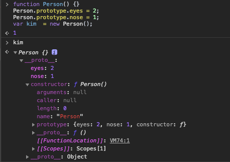
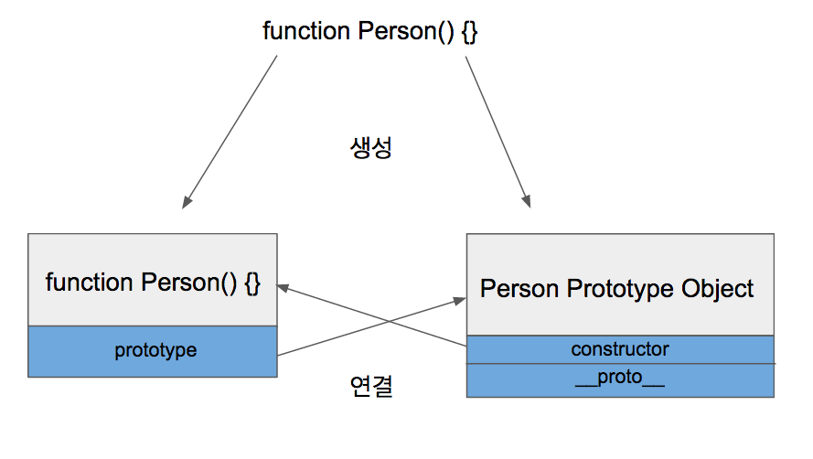

#  prototype

## TL;DR
- prototype 속성: prototype object를 참조하는 HOST Object의 속성
- `__proto`__ : Host Object의 prototype object를 참조하는 Host Object의 인스턴스의 속성
- prototype Object: 함수를 정의할 때 생성된다. constructor Object에 함수의 초기정보가 담겨있다.
- Host Object: 생성자 함수, prototype 속성을 가지고 있다.


## Intro

### 프로토타입 기반 프로그래밍
	객체의 원형인 프로토타입을 이용하여 새로운 객체를 만들어내는 프로그래밍 기법이다. 
	이렇게 만들어진 객체 역시 자기자신의 프로토타입을 갖는다. 
	이 새로운 객체의 원형을 이용하면 또 다른 새로운 객체를 만들어 낼수도 있으며 이런 구조로 객체를 확장하는 방식을 프로토타입 기반 프로그래밍이라고 한다.

자바스크립트에서는 Class가 없다. 그래서 자바스크립트에서는 객체의 원형인 프로토타입을 이용한 복사와 객체특성을 확장해 나가는 방식을 통해 새로운 객체를 생성한다. 자바스크립트의 프로토타입 객체의 확장은 옵져버패턴을 따른다. 지금으로서는 그다지 중요하게 알고 있을 필요는 없다.


## Prototype
```js
var foo = {
	name : "foo"
}
foo.prototype.a = "hello world";
console.log(foo.a);
```

자바스크립트에서 사용되는 프로토타입이란 용어는 크게 두가지로 나뉜다.
1. Prototype Object  
2. Prototype Link


###  1.Prototype Object
함수를 정의하면 함수(`Host Object`)와 함께 `Prototype Object`가 생성된다.  


```js
function Person() {}
Person.prototype.eyes = 2;
Person.prototype.nose = 1;
var kim  = new Person();
```

    
위 예제에서 `prototype Property`를 통해 `Prototype Object`에 `eyes`와 `nose`를 추가했습니다.


  

생성된 함수객체(Host Object)는 `prototype property`를 통해 `Prototype Object`에 접근할 수 있습니다.  
```js
Person.prototype
```
`Prototype Object`는 `counstructor`와 `__proto__`를 기본속성으로 가지고 있다.
- `counstructor` : Prototype Object와 같이 생성되었던 함수를 가리키고 있습니다.
- `__proto__` : `Prototype Linke`입니다.


### 2.Prototype Link
앞선 예제에서 kim객체 속성에 `eyes`가 없지만 2라는 결과가 나왔습니다. 이것은 `Prototype Object`를 참조하여 `Prototype Object`의 속성값을 출력한 것입니다.  
모든 객체는 `__proto__`라는 속성을 갖는데 이 속성은 Host Object(Person)의 `Prototype Object`를 참조합니다. 이 예제에서는 
 `__proto__`속성이 Person함수의 `Prototype Object`를 참조하는걸 확인할 수 있습니다.


#### 3.1 예제

```js
function Foo() {}
var foo = new foo();
```
  


```js
function Foo(x) {
    this.x = x;
};

var A = new Foo('hello'); 
console.log(A.x);
> hello

console.log(A.prototype.x)
> syntax error
```
`prototype property`는 `Host Object`(Foo)가 가지는 속성이다. A는 `__proto__`를 통해 `Prototype Object`를 참조한다.


### 3. Prototype Chain

```js
//#예제 1.
var A = function () {
    this.x = function () {
         //do something
    };
};
var a = new A();
console.log(a.x)

//#예제 2.
var A = function () { };
A.prototype.x = function () {
    //do something
};
```
`this.x`는 Host Object를 new 생성자로 생성한 객체(인스턴스)의 속성이고, 
A.prototype.x는 `prototype Object`에 등록된 속성이다.  


```js
//#예제 1 : 함수객체의 속성등록.
var A = function () {
    this.x = function () {          // (1)
         console.log('orign');
    };
};

A.x = function() {              // (2)
    console.log('changed');
};

var B = new A();
var C = new A();
B.x(); //orign
C.x(); //orign

```
여기서 origin이 나온 이유는 변수 탐색과정에서 생성자 함수의 속성으로 등록된 `(1)x`가 나온것이다.  
`A.x`는 함수객체의 속성이 된다. 함수도 객체임으로 속성을 등록할 수 있다.  
(참고:: Function.prototype의 속성을 한번 알아보자)  


```js
//#예제 2: 생성자함수의 속성추가와 프로토타입 함수 등록 비교.
var A = function () { };
A.x = function() {
    console.log('orign');
};
A.prototype.x = function () {
     console.log('changed');
};
var B = new A();
var C = new A();
B.x(); //changed
C.x(); //changed
```


위 예제에서 B,C를 생성하기 위한 객체 원형 프로토타입은 A다.  
여기서 중요한 것은 B,C는 A를 프로토타입으로 사용하기 위해서 A의 `Prototype Object`를 사용한다.   
그리고 이 `Prototype Object`는 A(Host Object)가 생성될 당시의 정보만 가진다. 따라서 에제1에서 x 호출결과가 orign가 된다. B,C는 `Prototype Object`를 참조하기 때문이다.  
예제2에서는 `prototype property`로 `Prototype Oeject`에 접근해서 속성 x를 추가했기 때문에 changed가 된것을 알 수 있다.


이 도식에서 볼 수 있듯이 객체 B,C는 `__proto__`(프로토타입링크)를 통해 A의 `Prototype Oject`를 참조하고 있다.  
`Prototype Obejct`에 접근하기 위해서는 원형함수 객체 가지고 있는 `prototype property`를 이용해야한다.


```js
// 예제3: 프로토타입 체인에 따른 속성을 찾는 우선순위.
var fooPrototype = {
    write: function(){
        return "[prototype] write";
    },
    read: function(){
        return "[prototype] read"
    }
};

function Foo() {
    this.write = function(){
        return "no write";
    }
}

Foo.prototype = fooPrototype;

foo = new Foo();

console.log(foo.write());
console.log(foo.read());

too = new Foo();
too.read = function() {         // (A)
    return "No read";
}

console.log(too.write());
console.log(too.read());

console.log('hasOwnProperty',too.hasOwnProperty('read'));
console.log('in','read' in too)

delete too.read;                //(B)

console.log('hasOwnProperty',too.hasOwnProperty('read'));
console.log('in','read' in too) //(C)


console.log(too.read());
```
- (A): 예제를 통해 확인 가능하듯 객체의 속성을 호춯하면 가장 먼저 해당 객체가 가진 속성을 검색하고 찾지 못하면 `prototype link`를 쫒아 프로퍼티를 찾는다.  
- (B): 객체의 프로퍼티를 지우니 프로토타입의 메서드가 호출되는게 확인된다.
- (C): in프로퍼티는 프로토타입 체인을 탐색하기 떄문에 true가 나온다.


### Prototype Property
	모든 함수 객체의 Contructor는 prototype이란 프로퍼티를 가지고 있다. 이 prototype Property는 객체가 생성될 당시 만들어지는 객체로 자신의 원형이될 prototype Object를 가리킨다. 즉 자신(Host Object)을 만든 원형이 아닌 자신(Host Object)을 통해 만들어질 객체(Instance)들이 원형으로 사용할 객체를 말한다. prototype object는 default로 empty Object를 가리킨다.  
    Instance들은 __proto__를 통해 Prototype Object에 접근할 수 있다.


자바스크립트의 모든 객체는 생성과 동시에 자기 자신이 생성될 당시의 정보를 가진 `Prototype Object`라는 객체를 복사해서 생성한다. 프로토타입이 객체를 만들어내기 위한 원형이라면 `Prototype Object`는 자기 자신의 분신이며 자신을 원형으로 만들어질 다른 객체가 참조할 프로토타입이다. 즉 객체 자신을 이용할 다른 객체들이 프로토타입으로 사용할 객체가 `Prototype Object`인 것이다. 위에서 언급한 `__proto__`에 대한 link는 상위에서 물려받은 객체의 프로토타입에 대한 정보이이다.

- 원형 함수는 `prototype property`를 이용해 `Prototype Object`에 접근할 수 있다.


### Prototype Chain

	객체의 생성 과정에서 모태가 되는 프로토타입과의 연결고리가 이어져 상속관계를 통하여 상위 프로토타입으로 연속해서 이어지는 관계를 말한다. __proto__를 따라 올라가게된다.


프로토타입 체인이란 프로토타입을 상속해서 만들어지는 객체들관의 연관관계를 의미한다. 그림에서 `__proto__`프로퍼티들간 이어진 점선을 타고 가다보면 최종적으로 Object객체의 Prototype Obejct가 나온다. 그렇기 떄문에 자바스크립트의 모든 객체는 Object 객체에서부터 패상됐다고 할 수있다.  


이러한 프로토타입 체인은 하위 객체에서 상위 객체의 프로퍼티와 메소드를 상속받는다. 그리고 동일한 이름의 프로퍼티와 메소드를 재정의 하지 ㅇ낳느 이상 상위에서 정의한 내용을 그대로 물려받는다. 정확히는 `Prototype Obejct`를 참조하고 있다고 하는것이 맞으며 다음 예제는 참조값이 바뀌면 하위 객체에 영향이 간다는걸 보여준다.
```js
var A = function () { };
A.prototype.x = function () {
     console.log('hello');
};
var B = new A();
var C = new A();

B.x();
> hello 

C.x();
> hello 

A.prototype.x = function () {
     console.log('world');
};

B.x();
> world

C.x();
> world
```


`A.prototype.x`를 통해 추가한 메서드가 `A Prototype Obejct`에 추가된 것을 확인할 수 있다. A를 통해 생성된 객체들은 프로토타입 체인을 통하여  `A Protptype Object`을 참조하고 있으며 x메소드를 공유한다.


프트토타입 체인을 통한 탐색을 다음 도식으로 설명할 수 있다.  
x라는 메소드를 하위 객체에서 찾지 못하면 상위객체에서 해당 메소드를 탐색한다. 프로토타입 체인을 따라 최상위 객체까지 탐색하며 결과를 찾지 못하면 `undefined`가된다.


다음은 프로퍼티 공유와 상송을 구분하기 위한 예제다.
```js
var A = function() {};
var B = new A();
A.prototype.x='hello';
console.log(B);
```
`prototype Object`의 속성으로 등록한다.

```js
var A = function() {
	this.x='hello';
};
var B = new A();
console.log(B);
```
x속성은 A객체에 종속된다.  
`prototype Object`에는 없다.


### REF
- [쉬운 설명](https://im-developer.tistory.com/98)
- [insanehong](http://insanehong.kr/post/javascript-prototype/)
- [javascript protptype](https://medium.com/@bluesh55/javascript-prototype-%EC%9D%B4%ED%95%B4%ED%95%98%EA%B8%B0-f8e67c286b67)
- [zeroCho](https://www.zerocho.com/category/JavaScript/post/573c2acf91575c17008ad2fc)
- [what is Object prototype](http://insanehong.kr/post/javascript-prototype/)
- [쉽게 이해하는 프로토타입  체인](https://blog.shiren.dev/2017-02-21-%EC%89%BD%EA%B2%8C-%EC%9D%B4%ED%95%B4%ED%95%98%EB%8A%94-%EC%9E%90%EB%B0%94%EC%8A%A4%ED%81%AC%EB%A6%BD%ED%8A%B8-%ED%94%84%EB%A1%9C%ED%86%A0%ED%83%80%EC%9E%85-%EC%B2%B4%EC%9D%B8/)