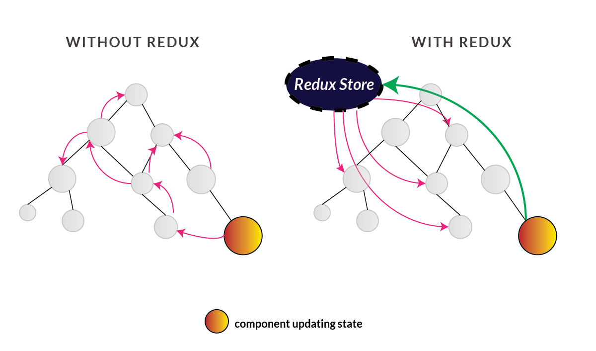

# REDUX

FLUX 아키텍쳐를 편하게 사용할 수 있게 해주 상태관리 라이브러리.
그리고 react-redux는 리액트에서 redux를 쉽게 사용하기 위한 라이브러리다. 
redux를 사용함으로서 기존의 구조에서 컴포넌트간 상태전달을 위해서 직계 부모를 거쳐 전달하는 상태관리의 단점을 극복할 수 있다. 
redux를 이해하기 위해서 몇가지 용어를 이해해야한다. 

## 개념

1. Store
    - 어플리케이션의 상태값을 저장한다.
    - 모든 상태값을 담고 있다.
    - 컴포넌트는 직접 교류하지 않고 store에 저장된 상태값을 공유함으로서 교류한다.

2. Action
    - 상태를 변화시킬 때 참조하는 객체
    - 일으킬 변화에 대한 명세가 담겨있다고 볼 수있다.

3. Dispatch
    - 스토어에 액션 객체를 전달하는 과정
    - 스토어를 구독중정인 컴포넌트에 변화가 생기면 액션객체을를 디스패치를 통해 스토어에 전달한다.
    - ex) store.dispatch(action);

4. Reducer
    - 리듀서 : 변형하는 것
    - 리덕스 내에서 변화를 일으키는 함수
    - 액션객체를 기반으로 상태변경을 결정한다.
    - 상태관리 데이터가 변형되었을때 리듀서가 실행되며 이때 실행에 대한 상세 명세는 액션객체를 따른다.

5. Subscription
    - 상태값을 Store를 통해 관리가 필요한 컴포넌트는
    Store를 구독(Subscription)한다.
    - 상태값이 변경되면 스토어를 구독중인 컴포넌트를 리랜더링한다.
    - 정확하게는 전달받은 리스너를 호출한다.
    - 이 리스너를 통해서 컴포넌트를 새롭게 변경된 상태값을 받고 리랜더링한다.
    - store.subscribe(listener);

   
## 요약

1. 스토어는 애플리케이션의 상태값을 관리한다.
2. 컴포넌트는 상태값 관리를 위해 스토어를 구독합니다.
3. 컴포넌트는 상태값 변경이 필요한 이벤트를 발생했을때
스토어에 저장된 상태값을 수정하기 위해서 스토어에게
store.dispatch(액션생성함수)로 알린다.
4. dispatch를 통해 액션정보를 전달받은 스토어는 리듀서를 실행하여
액션타입에 따라 상태값은 변화시킨다.
5. 상태값을 변화하면 구독중인 컴포넌트에게 알린다.
(정확히는 컴포넌트를 리스너(랜더링하는 함수)를 스토어에 등록(구독)하고 상태값의 변화가 생겼을때 리스너를 실행시킨다.)

### FLUX 아키텍쳐

- https://blog.coderifleman.com/2015/06/19/mvc-does-not-scale-use-flux-instead/
- https://taegon.kim/archives/5288
- https://bestalign.github.io/2015/10/06/cartoon-guide-to-flux/

# 기술 발전 시리즈

1. 페이스북이 MVC대신에 FLUX 아키텍쳐를 선택한 이유
2. FLUX 라이브러리 redux
3. redux를 편하게 사용하기 위한 react-redux, react-actions
4. 객체 불변성을 편리하게 구현하기 위한 immulate.js
5. 미들웨어를 사용하기 위한 react-thunk
6. 비동기 통신을 위한 axios 라이브러리