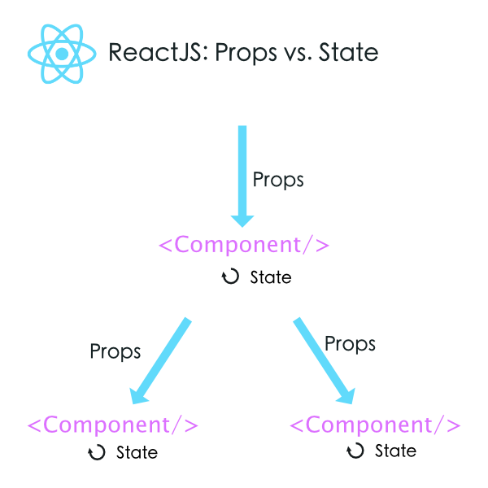

# Component


## intro
리액트는 함수형 프로그래밍을 지향한다.  
함수형 프로그래밍의 관점에서 컴포넌트는 입력값으로 props를 받고, React element tree를 반환하는 순수 함수라 볼 수 있다.  
리액트 공식 문서에서는 컴포넌트를 이렇게 설명한다.  

    All React components must act like pure functions with respect to their props.

컴포넌트는 순수함수처럼 동작하기 prop가 같다면 항상 같은 UI를 렌더링해야 한다.  

리액트 애플리케이션에서 UI는 개별적인 컴포넌트의 조합이다.  
즉, 컴포넌트는 화면을 구성하는 독립된 모듈이다.  
다른 화면에서 재사용이 가능하며 고차 함수와 마찬가지로 고차 컴포넌트를 만들어 기능을 확장할 수 있다.  
 
리액트에서는 화면을 모듈 단위로 개발함으로서 유닛 단위로 테스트, 사고를 할 수 있다.


## 모듈이란?
프로그래밍 언어에서 모듈이란, **프로그램을 하나의 기능을 수행하는 작은 단위로 나눈것** 이라고 설명할 수 있다. 
유지보수 관점에서 프로그램이 독립적인 기능을 수행하는 모듈로 나누어 구성이 되어있으면 가독성이 훨씬 좋아진다.  
각 모듈이 맡은 동작을 잘 수행히는지 테스트할 수 있기 때문이다. 다음은 모듈화의 장점이다. 
앞서 컴포넌트를 UI를 구성하는 모듈이라고 설명했는데 모듈 관점에서 컴포넌트를 생각해보면 특징을 공유하고 있음을 알 수 있다.  

- 재사용성: 재사용성이 높아진다.
- 가독성: 하나의 기능을 수행하는 파일단위로 나누어 가독성이 좋아진다.
- 테스트: 모듈별 유닛 테스트가 가능하다.
- 생산성: 기능별로 나누어 개발이 가능하다.  
- 메모리관리: 필요한 모듈만 로딩하면 되기 때문에 메모리관리에 유리하다.

이런 특징은 모두 리액트에서 컴포넌트와 일치한다.  
즉, 리액트에서 **컴포넌트는 UI를 구성하며 독립적 기능을 수행하는 모듈이다.**


## 컴포넌트의 특징

- 특정 state, props에 따른 render 결과가 바뀌지 않는다.
- 컴포넌트는 상태에 따른 가변적인 엘라먼트에 대한 정의다.
- 컴포넌트 간 합성을 할 수 있다.
- 컴포넌트 단위 테스트가 가능하다.
- 가독성이 좋다


## props와 state를 어떻게 구분하여 사용하는지?
1. prop  
컴포넌트 간에는 무조건 props를 통해서만 데이터를 주고받고 props는 컴포넌트 내부에서 변경되지 않는다.

2. state  
컴포넌트에서 관리하는 상태 값으로 유동적인 데이터를 다룰 때, state를 사용한다.  

## 상태 관리를 어떻게 해야할까? 
1. 상태관리 모듈이 필요한 이유
컴포넌트간 상태값 전달로 인한 의존성에 의해 복잡도가 증가하며 사이드 이펙트 발생하기 쉬운 구조가 됨.  
따라서 컴포넌트 트리가 복잡한 어플리케이션에선 전역에서 컴포넌트의 상태를 보관하고 관리하는 저장소에서 관리가 필요함.


## 클래스 기반 컴포넌트 vs 함수형 컴포넌트
함수형 컴포넌트가 클래스 기반의 컴포넌트와 다른점은 무엇일까?  
함수형 컴포넌트는 클래스 기반의 컴포넌트와 달리 Life cycle method와 ref 콜백을 사용 할 수 없다(context는 사용 할 수 있다)  

그럼 왜 함수형 컴포넌트를 쓸까?  
함수형 컴포넌트를 사용하면 컴포넌트를 간결하게 작성할 수 있으며, 개별 상태가 없으므로 이해하기 쉽고 예측이 쉬우며 테스트를 간단히 할 수 있다.  
또한 라이프사이클을 사용하지 않으므로 불필요한 검사 및 메모리 할당을 줄일 수 있다.  
따라서 React에서는 함수형 컴포넌트 컴포넌트를 많이 사용하고 클래스 컴포넌트는 적게 사용하는것을 권고한다.  
(참고:[react-stateless-functional-components](https://hackernoon.com/react-stateless-functional-components-nine-wins-you-might-have-overlooked-997b0d933dbc))

리액트는 왜 클래스 컴포넌트를 디자인했을까?  
컴포넌트의 상태를 관리하거나 생명주기(Life Cycle)에 훅(Hook)을 걸어 원하는 시점에 특정 함수를 실행하려면 순수 함수만으로는 구현이 어려울 것이다.  
그렇기 때문에 처음 리액트가 나왔을 때는 createClass 함수를 이용하여 컴포넌트를 생성하도록 API가 설계되었다. 
다른 이유는 기존 객제지향 개발자들에게 함수형 프로그래밍은 익숙하지 않기 때문에 좀더 익숙한 클래스 형태의 API를 제공한 것이다. 


## 함수형을 쓸 때 고려 해야 하는 상황
- 해당 컴포넌트는 자체 기능은 따로 없고 props가 들어가면 뷰가 나온다


## 함수형 컴포넌트 지향, 그럼 클래스형 컴포넌트는 언제 쓸까?
- 라이프사이클 API가 필요 할 때


### 고차 컴포넌트 (Higher Order Component)

컴포넌트를 입력받고 컴포넌트를 반환하는하는 함수다.  
여러 컴포넌트에서 공통으로 사용하는 로직을 한 컴포넌트의 역할로 분리하여 컴포넌트의 내부 로직을 간결하고 명확하게 유지하게 한다. 이를 통해 컴포넌트들의 재사용성을 높힐 수 있다.  

```js
import { Component } from "React";

export var Enhance = ComposedComponent => class extends Component {
  constructor() {
    this.state = { data: null };
  }
  componentDidMount() {
    this.setState({ data: 'Hello' });
  }
  render() {
    return <ComposedComponent {...this.props} data={this.state.data} />;
  }
};
```

```js
import { Enhance } from "./Enhance";

class MyComponent {
  render() {
    if (!this.data) return <div>Waiting...</div>;
    return <div>{this.data}</div>;
  }
}

export default Enhance(MyComponent); // Enhanced component

```


## Presentational and Container Components

이 패턴은 한마디로 **관심사를 분리하는 방법**이다.  
기존의 컴포넌트에서 데이터 로직이 추가되면서 재사용성이 떨어지고 로직과 Lifecycle이 복잡해져 컴포넌트의 정의가 난해해졌다.  
컨테이너 컴포넌트가 데이터 관련 로직을 담당함으로써 프리젠테이셔널 컴포넌트는 뷰만 담당하게 되어 특수성을 분리했다.
 

### Presentational 컴포넌트
- 컴포넌트의 뷰만 신경쓴다
- render에 관련된 로직
- UI를 위한 state가 존재할 수 있습니다.
- 의존성 독립

### Container 컴포넌트
- 데이터를 다룬다
- 동작을 설명한다.
- 스타일 코드가 없다
- 데이터, 이벤트, 다른 컨테이너 컴포넌트를 제공


## Q&A

### 1. 컴포넌트란?
컴포넌트는 상태값에 따른 가변적인 엘리먼트를 정의한 순수 함수이다.

### 2. 컴포넌트 단위 개발의 이점은?
1. 재사용성: 상태관리 로직을 포함하고 있어 재사용에 용이함
2. 테스트: 독립된 모듈임으로 테스트에 용이함
3. 가독성: 컴포넌트별 기능분리를 통해 가독성이 향상됨
4. 메모리 관리: 필요한 부분만 로딩

### 3. 왜 setState는 비동기인가?
직접 `setState`대신 컴포넌트 객체를 수정하면 안되나?  
```js
// Wrong
this.state.comment = 'Hello';
```
해당 객체의 reference값을 기준으로 리랜더링이 이뤄지기 때문에 안된다. `setState`는 React는 현재 state와 제공한 객체를 병합하고 새로운 객체를 반환하여 변경 가능성을 고지한다.  
```js
// Correct
this.setState({comment: 'Hello'});
```

한가지 짚고 넘어가야 할것이 있다.  
`setState`가 비동기 함수라는 점이다. 왜 그럴까?  
**간단히 말하면 화면 갱신을 자연스럽게 하기 위함이다.**  
동기함수를 가정해보면 state 변경이 많을수록 render는 모든 변경이 적용될 때까지 늦어지기 때문에 실제 화면이 부자연스럽게 동작하게 될 것이다. 즉 끊김 없는 원활한 UI/UX를 제공하기 위해 일정 수의 render가 수행되어야한다.


### 4. 고차 컴포넌트를 사용하는 이점이 뭔가?
- 코드 재사용, 로직 및 부트스트랩 추상화
- Render Highjacking
- 상태 추상화 및 조작(manipulation)
- props 조작(manipulation)

### 5. 언제 고차 컴포넌트를 사용하는가?
- 간단한 예를 든다면?


### 6. presentational components:

### 7. 클래스형 컴포넌트를 써야하만하는 구체적인 상황은?

### 8. 왜 함수형 컴포넌트를 쓸까?

### 9. 컴포넌트를 최적화하려면?
리랜더링 최소화

### 10. UI를 설계할 때 어떤 기준으로 컴포넌트를 분리 할까?
- 기능 
- 재활용성 


### 11. 재사용 가능한 컴포넌트란?
1. 프리젠테이션 컴포넌트
- 데이터 로드 로직이 분리
2. 컨테이너 컴포넌트


## ref
- [doc-component](https://reactjs-kr.firebaseapp.com/docs/components-and-props.html)
- [higher-order-components](https://reactjs-kr.firebaseapp.com/docs/higher-order-components.html)
- [웹 컴포넌트](https://reactjs-kr.firebaseapp.com/docs/web-components.html)
- [ Higher Order Components 설명](https://www.vobour.com/%EC%83%81%EC%84%B8%ED%95%9C-%EB%A6%AC%EC%95%A1%ED%8A%B8-higher-order-components-%EC%84%A4%EB%AA%85-react)
- [함수형 setState가 리액트(React)의 미래이다](https://www.vobour.com/%ED%95%A8%EC%88%98%ED%98%95-setstate%EA%B0%80-%EB%A6%AC%EC%95%A1%ED%8A%B8-react-%EC%9D%98-%EB%AF%B8%EB%9E%98%EC%9D%B4%EB%8B%A4-functiona)
- [React - Functional Component의 장점](https://boxfoxs.tistory.com/395)
- [리액트 HOC 집중 탐구](https://meetup.toast.com/posts/137)
- [리액트 HOC 집중 탐구_2](https://meetup.toast.com/posts/144)
- [react의-기본-컴포넌트를-알아보자](https://medium.com/little-big-programming/react%EC%9D%98-%EA%B8%B0%EB%B3%B8-%EC%BB%B4%ED%8F%AC%EB%84%8C%ED%8A%B8%EB%A5%BC-%EC%95%8C%EC%95%84%EB%B3%B4%EC%9E%90-92c923011818)
- [how-are-function-components-different-from-classes](https://overreacted.io/how-are-function-components-different-from-classes/)
- [Presentational and Container Components](https://medium.com/@dan_abramov/smart-and-dumb-components-7ca2f9a7c7d0)
- [React 컴포넌트 상태 객체](https://velog.io/@kyusung/%EB%A6%AC%EC%95%A1%ED%8A%B8-%EA%B5%90%EA%B3%BC%EC%84%9C-React-%EC%BB%B4%ED%8F%AC%EB%84%8C%ED%8A%B8%EC%99%80-%EC%83%81%ED%83%9C-%EA%B0%9D%EC%B2%B4)
- [component-vs-purecomp](https://www.vobour.com/%EB%A6%AC%EC%95%A1%ED%8A%B8-react-%EC%9D%B4%ED%95%B4-%EA%B8%B0%EC%B4%88-component-vs-purecomp)
- [React 애플리케이션 아키텍처](https://www.slideshare.net/byungdaesohn/react-76078368?from_action=save)
- [React Stateless Functional Components](https://hackernoon.com/react-stateless-functional-components-nine-wins-you-might-have-overlooked-997b0d933dbc)