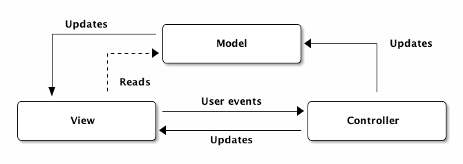
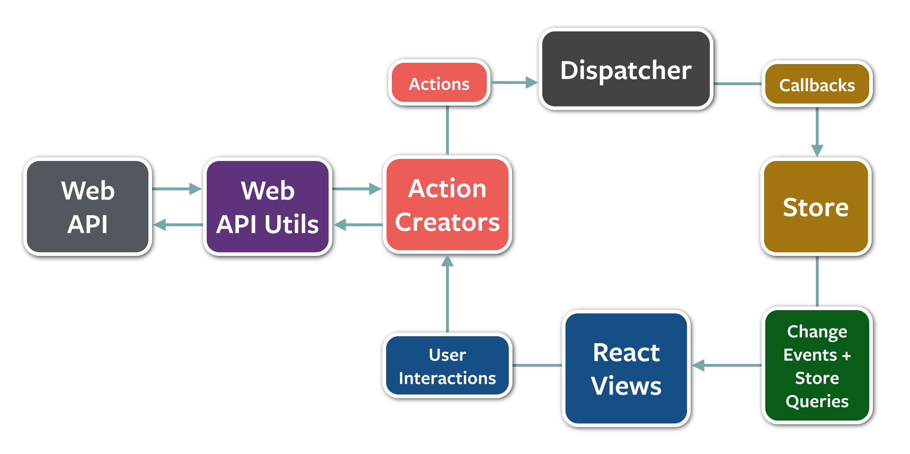

# Flux


## intro

Facebook이 MVC패턴의 양방향 데이터 바인딩 구조에서 야기될 수 있는 시스템 복잡도를 해결하고자 고안한 단방향 시스템 아키텍쳐이다.

- 데이터 변경의 제어를 총괄하는 중앙컨트롤러

## 사전지식

### MVC

FLUX가 등장하기 전 프론트엔드에서는 MVC패턴으로 데이터의 흐름을 관리했습니다.


- Model: 데이터의 형식이나 구조를 관리한다.
- View: 코드가 사용자에게 보여지는 부분을 담당한다.
- Controller: 변화하는 데이터를 관리한다 view에서 발생하는 이벤트로 변경되는 데이터나 서버로부터 받은 변경된 데이터를 Model과 view에 업데이트 해준다

MVC의 가장 큰 특징은 **양방향 데이터 흐름**인데 어플리케이션의 규모가 커졌을 때 데이터 흐름을 추적하기 어렵다는 단점이 있습니다.


## 등장배경

Flux는 양방향 데이터 바인딩을 하는 MVC패턴의 문제를 해결하고자 등장했습니다.  
양방향 데이터 바인딩은 연속적인 갱신이 발생하고 객체 하나의 변경이 다른 객체를 변경하게 되어 실제 필요한 업데이트보다 더 많은 분량을 실행하게 됩니다.
어플리케이션의 규모가 커지면 데이터의 연속적인 갱신이 발생하는 상황에서는 사용자 상호작용의 결과가 어떤 변화를 만드는지 예측하는데 어려워집니다.

MVC패턴에서는 Model에 데이터를 정의해 두고, Controller를 통해 Model의 데이터를 생성, 조회, 수정, 삭제하고 변경된 데이터는 View에 출력되면서 사용자에게 전달됩니다.  
이 패턴에서 시스템 복잡도가 증가하는 시나리오를 예를 들어보겠습니다.  
사이드바에 내가 단 최신 댓글이 보이는 게시판이 있다고 생각해보겠습니다.
그리고 이 게시판의 헤더에 모든 댓글이 실시간으로 카운팅되고 있습니다.

이런 게시시판에서 내가 어떤 포스트에 댓글을 달았는데 등록하고나서 그 글이 삭제됐다면 어떤 일이 생길까요?
MVC에서 Model이 늘어날 수록 전파해야 할 대상이 늘어납니다.  
하나의 포스트가 삭제되면 포스트에 달린 댓글이 삭제되고 이 댓글을 작성한 유저의 화면에서 덧글 카운터와 최신덧글 사이드바에 변경사항이 전파되야합니다.  
이를 구현하기 위해서 MVC패턴에서는 사이드바와 헤더의 데이터를 관리하는 모델들이 포스트의 모델을 모니터링하다가 변경사항이 있을때 전파를 받아야합니다.  
이처럼 각각의 모델들의 의존성은 코드를 복잡하게 만듭니다.

이 문제를 해결하기 위해 Flux가 등장했습니다.  
이제 View는 MVC패턴과 달리 데이터를 변경하지 않습니다. 대신 Dipatch를 통해 Action객체를 Store에 넘겨주고 Store에서 데이터 변경이 이뤄집니다. Action은 데이터 변경에 대한 주문서정도로 이해할 수 있습니다. 이렇게 Store에서 변경된 데이터는 다시 View에게 전파 됩니다.


Action을 Dispatcher를 통해 Store에 전달하면 데이터가 변경되어 해당 데이터를 사용하는 View로 전달됩니다.

아래 그림은 View에서 이벤트를 트리거하는 상황입니다.


## 구성

### Action creator

모든 변경사항과 사용자와의 상호작용이 거쳐가야 하는 액션을 생성한다.  
애플리케이션의 상태를 변경하거나 뷰를 업데이트하고 싶다면 액션을 생성해야만 한다.  
컴포넌트가 어떤 메시지를 보낼지 알려주면 액션 생성자는 나머지 시스템이 이해할 수 있는 포맷으로 바꿔준다.  
액션 생성자가 액션 메시지를 생성한 뒤에는 디스패쳐(dispatcher)로 넘겨준다.

```js
// action object
{
    type: INCREASE,
    payload: {
        ...
    }
}
```

### Dispatcher

디스패쳐는 기본적으로 콜백(callback)이 등록되어있는 곳이다. 디스패쳐는 액션을 보낼 필요가 있는 모든 스토어(store)를 가지고 있고, 액션 생성자로부터 액션이 넘어오면 여러 스토어에 액션을 보낸다.  
이 처리는 동기적으로(synchronously) 실행된다. 만약 스토어들 사이에 의존성(dependency)이 있어서 하나를 다른 것보다 먼저 업데이트를 해야한다면, `waitFor()`를 사용해서 디스패쳐가 적절히 처리하도록 할 수 있다.

flux의 디스패쳐는 액션 타입과는 관계없이 등록된 모든 스토어로 보내진다. 이말인 즉슨, 스토어가 특정 액션만 구독(subscribe)하지 않고 모든 액션을 일단 받은 뒤 처리할지 말지를 결정한다는 뜻이다.

### Stores

Store는 어플리케이션의 상태와 상태 변화로직을 포함하고 있다.  
모든 상태 변경은 반드시 스토어에 의해서 결정되어야만 하며, 상태 변경을 위한 요청을 스토어에 직접 보낼 순 없다.  
스토어가 디스패쳐에 등록되어 있다면, 모든 액션을 받게 될 것이다. 스토어의 내부에서는 보통 switch statement를 사용해서 처리할 액션과 무시할 액션을 결정하게 된다. 만약 처리가 필요한 액션이라면, 주어진 액션에 따라서 무엇을 할 지 결정하고 상태를 변경하게 된다.

일단 스토어에 상태 변경을 완료하고 나면, 변경 이벤트(change event)를 내보낸다. 이 이벤트는 컨트롤러 뷰(the controller view)에 상태가 변경했다는 것을 알려주게 된다.

### Views(React 컴포넌트), controller-view

뷰는 상태를 상태를 가져오고 유저에게 보여주고 입력받을 화면을 렌더링하는 역할을 맡는다.  
뷰는 애플리케이션 내부에 대해서는 아는 것이 없지만, 받은 데이터를 처리해서 사람들이 이해할 수 있는 포맷(HTML)으로 변경하여 보여주는 역할만 수행한다.

컨트롤러 뷰는 스토어와 뷰 사이의 중간관리자같은 역할을 한다.  
상태가 변경되었을 때 스토어가 그 사실을 컨트롤러 뷰에게 알려주면, 컨트롤러 뷰는 자신의 아래에 있는 모든 뷰에게 새로운 상태를 넘겨준다.

## How to use

### 준비

1. 스토어는 디스패쳐에 액션이 들어오면 알려달라고 말해둔다.
2. 컨트롤러 뷰는 스토어에게 최신 상태를 묻는다.
3. 스토어가 컨트롤러 뷰에게 상태를 주면 렌더링하기 위해 모든 자식 뷰에게 상태를 넘겨준다.
4. 컨트롤러 뷰는 스토어에게 상태가 바뀔 때 알려달라고 다시 부탁한다.

## 데이터 흐름



1. 뷰는 액션 생성자에게 액션을 준비하라고 말한다.
2. 액션 생성자는 액션을 포맷에 맞게 만들어서 디스패쳐에 넘겨준다.
3. 디스패쳐는 들어온 액션의 순서에 따라 알맞은 스토어로 보낸다. 각 스토어는 모든 액션을 받게 되지만 필요한 액션만을 골라서 상태를 필요에 맞게 변경한다.
4. 상태 변경이 완료되면 스토어는 자신을 구독(subscribe)하고 있는 컨트롤러 뷰에게 그 사실을 알린다.
5. 연락을 받은 컨트롤러 뷰들은 스토어에게 변경된 상태를 요청한다.
6. 스토어가 새로운 상태를 넘겨주면, 컨트롤러 뷰는 자신 아래의 모든 뷰에게 새로운 상태에 맞게 렌더링하라고 알린다.

### REF

- [flux시작하기](https://kkak10.gitbooks.io/flux/index.html)
- [Singletons Suck ](https://www.rea-group.com/blog/singletons-suck-aka-flux-to-redux/)
- [why redux](https://www.slideshare.net/dalinaum/redux-55650128)
- [ FluxUtils](https://www.slideshare.net/UyeongJu/fluxutils)
- [the-case-for-flux](https://medium.com/swlh/the-case-for-flux-379b7d1982c6)
- [Flux overview-kor](https://haruair.github.io/flux/docs/overview.html)
- [Flux.io](http://facebook.github.io/flux/docs/in-depth-overview)
- [what-the-flux-lets-redux](https://blog.andyet.com/2015/08/06/what-the-flux-lets-redux/)
- [redux-kr](https://lunit.gitbook.io/redux-in-korean/)
- [페이스북이Flux를채택한이유](https://blog.coderifleman.com/2015/06/19/mvc-does-not-scale-use-flux-instead/)
- [Flux와 Redux](https://taegon.kim/archives/5288)
- [FLUX카툰으로이해하기](https://bestalign.github.io/2015/10/06/cartoon-guide-to-flux/)
- [Flux and MVC](https://beomy.tistory.com/44)
- [redux_cartton_korean](http://bestalign.github.io/2015/10/26/cartoon-intro-to-redux/)
- [redux 적용기](https://d2.naver.com/helloworld/1848131)
- [actions-and-the-dispatcher](https://haruair.github.io/flux/docs/actions-and-the-dispatcher.html#content)
