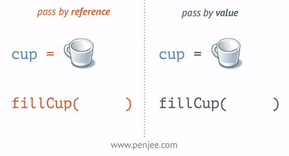

# optimization

## TL;DR
- 리액트의 리랜더링 프로세스를 이해한다.
- 재조정을 최소화한다.
- 캐싱과 메모리제이션을 이용한다.


## intro
리액트가 언제 리 랜더링을할까
- 자신이 전달받은 props가 변경될 때
- 자신의 state가 바뀔 때
- 부모 컴포넌트가 리렌더링될 때
- forceUpdate 함수가 실행될 때


## 1. 재조정(Reconciliation)을 피하라

**재조정**  
- 리액트 엔진이 가상돔과 실제돔을 비교하는 과정.  
- React가 어떤 컴포넌트를 업데이트할 지 안할 지 여부를 결정하는 알고리즘적 방법론  
[출처](https://im-developer.tistory.com/198)  
  
- SCU: shouldComponentUpdate의 반환값
- vDOMEq: 가상돔과 실제 돔이 동일한지?

**불변성**  
  

```js
{ a: 10 } === { a: 10 } // false
```
데이터 불변성은 데이터 변경의 추적 비용을 저렴하게 만든다.  
- 참조만 비교해도 변경사항을 추적할 수 있다.


### Sol) 1. shouldComponentUpdate

```jsx
shouldComponentUpdate(nextProps, nextState) {
  return true;
}
```
- 기본값은 true이며 false를 반환하면 재조정을 하지 않는다.
- 업데이트가 필요없다는 것을 알고 있는 상황에서 false를 반환하면 불필요한 재조정을 피할 수 있다.
- 웬만하면 React.PureComponent를 사용하고 얕은 비교를 통해 검증할 수 없는 경우에만 shouldComponentUpdate를 하는게 낫다.


### Sol) 2.React.PureComponent
- **변경되는 데이터가 모두 원시값이거나 각각의 불변성이어야한다.**
- 업데이트가 필요없는 경우에 React.PureComponent를 상속받아라.
- shouldComponentUpdate를 직접 구현하는 것은 지양해라.
- state와 props를 얕은 비교를 해서 shouldComponentUpdate에 true나 flase를 반환한다.

컴포넌트의 prop이나 state가 변경되면 React는 새로 반환된 엘리먼트를 이전에 렌더링된 엘리먼트와 비교하여 실제 DOM 업데이트가 필요한지 여부를 결정한다. 이 때, 비교 내용에 차이가 있다면, React는 실제 DOM을 업데이트하게 되는 것이다.

React가 변경된 부분의 DOM 노드만 업데이트하더라도 이 리렌더링에는 여전히 다소 시간이 걸리는데, 대부분의 경우에는 문제가 되지 않지만 속도 저하가 눈에 띄는 경우, 리렌더링이 시작되기 전에 실행되는 shouldComponentUpdate로 해당 기능을 무시하여 속도를 높일 수도 있다


일부 상황에서 특정 컴포넌트를 업데이트할 필요가 없다는 것을 알고 있다면, shouldComponentUpdate에서 false를 반환함으로써 컴포넌트와 그 자식 컴포넌트에서 render()를 호출하는 것을 포함해 전체 렌더링 프로세스를 건너뛰게 할 수도 있다.


대부분의 경우에 shouldComponentUpdate()를 직접 작성하는 대신에, React.PureComponent에서 상속받을 수 있다. 해당 컴포넌트는 현재 및 이전의 prop / state의 얕은 비교를 통해 shouldComponentUpdate()를 호출하는 것과 동일하다.


**데이터를 직접 변경하지마라**
```jsx
class ListOfWords extends React.PureComponent {
  render() {
    return <div>{this.props.words.join(',')}</div>;
  }
}

class WordAdder extends React.Component {
  constructor(props) {
    super(props);
    this.state = {
      words: ['marklar']
    };
    this.handleClick = this.handleClick.bind(this);
  }

  handleClick() {
    // This section is bad style and causes a bug
    const words = this.state.words;
    words.push('marklar');
    this.setState({words: words});
  }

  render() {
    return (
      <div>
        <button onClick={this.handleClick} />
        <ListOfWords words={this.state.words} />
      </div>
    );
  }
}
```
위 경우에 PureComponent를 사용하면 words에 대한 참조가 유지되기 때문에 배열값이 변한것을 감지하지 못한다.  
데이터를 직접 변경하게 될 경우 이런 문제가 생기기 때문에 새로운 객체를 만들어 할당하는 것이 낫다.

```jsx
handleClick() {
  this.setState(state => ({
    words: [...state.words, 'marklar'],
  }));
};
```

이렇게 하면 불변성을 보장할 수 있다.


### Sol) 3.React.memo
라이프사이클 메서드를 사용할수 없는 함수형 컴포넌트에서는 어떻게 재조정을 피할 수 있을까?
함수형컴포넌트에서는  React.memo라는 함수를 사용한다. 컴포넌트의 props가 바뀌지 않았다면, 리렌더링하지 않도록 설정하여 함수형 컴포넌트의 리렌더링 성능을 최적화해 줄 수 있다.
- props가 변하지 않으면 React는 컴포넌트를 렌더링하지 않고 마지막으로 렌더링된 결과를 재사용합니다.
- 함수형 컴포넌트를 감싸서 해당 컴포넌트의 prop이나 state가 얕게(shallowly) 변경되었을 때만 re-render하도록 만든다.

- (props를 메모리에 저장하고 동일한 입력이 반복되서 발생하면 캐시된 출력을 반환한다.)
- React.memo는 props 변화에만 영향을 줍니다. 
- 얕은비교가 아닌 비교 동작을 원한다면, 두 번째 인자로 별도의 비교 함수를 제공하면 됩니다.

React.memo의 사용법은 매우 간단하다. 컴포넌트를 만들고 나서 감싸 주기만 하면 된다.
```jsx
import React from 'react';
import {
  MdCheckBoxOutlineBlank,
  MdCheckBox,
  MdRemoveCircleOutline,
} from 'react-icons/md';
import cn from 'classnames';
import './TodoListItem.scss';
 
const TodoListItem = ({ todo, onRemove, onToggle }) => {
  (...)
};
 
export default React.memo(TodoListItem)
```


```jsx
function MyComponent(props) {
  /* props를 사용하여 렌더링 */
}
function areEqual(prevProps, nextProps) {
  /*
  nextProp가 prevProps와 동일한 값을 가지면 true를 반환하고, 그렇지 않다면 false를 반환
  */
}
export default React.memo(MyComponent, areEqual);
```
상태비교 함수를 직접 전달해 줄 수 있는데 
이때 false를 반환해야 리 랜더링이 발생한다.  
shouldComponentUpdate에서 true를 반환해야 리랜더링이 발생하는 것과 헷갈리지 말자.


## 불필요한 렌더링을 막기

### 1. 정적인 데이터는 컴포넌트외부에 선언해라.
- 상수데이터는 컴포넌트 외부에서 정적으로 선언해준다.
- render함수에는 가능한 리터럴변수를 생성하지 않는게 좋다.
- 같은 이유로 인라인 함수를 사용하지 않는게 좋다 (매번 생성)

```jsx
const UPLOAD_DENY_TYPES = ["video", "gif"];
const UPLOAD_COMPONENT_CONTENT = <strong>업로드</string>

class Render extends PureComponent {
	state = {file : null }
	render() {
		return (
			<FileUploadInput
				deny={UPLOAD_DENY_TYPES}
				onUpload={(file) => {this.setState({ file })}
			>
				{UPLOAD_COMPONENT_CONTENT}
			</FileUploadInput
		)
	}
}

```

### 2. 즉각적인 변화가 필요 없는 데이터
-  클래스의 메서드를 만든다.

```jsx
const UPLOAD_DENY_TYPES = ["video", "gif"];
const UPLOAD_COMPONENT_CONTENT = <strong>업로드</string>

class Render extends PureComponent {
	state = {file : null }
	handleUpload = (file) => {
		this.setState({ file });
	}

	render() {
		return (
			<FileUploadInput
				deny={UPLOAD_DENY_TYPES}
				onUpload={this.handleUpload}
			>
				{UPLOAD_COMPONENT_CONTENT}
			</FileUploadInput
		)
	}
}
```

### 3. 즉각적인 변화가 필요한 데이터
- 분기값에 따라 결과가 달라지는 데이터.
- 메모리제이션을 통해 중복연산을 피한다.

```jsx
import memorize from 'lodash/memoize';

const UPLOAD_DENY_TYPES = ["video", "gif"];

class Render extends PureComponent {
	state = {file : null }
	handleUpload = (file) => {
		this.setState({ file });
	}

    returnUploadChildren = memoize((isUpload) => 
         <string>
            {isUpload ? "업로드되어 있음" : "업로드 하기"}
        </string>
    )

	render() {
		return (
			<FileUploadInput
				deny={UPLOAD_DENY_TYPES}
				onUpload={this.handleUpload}
			>
                {this.returnUploadChildren(Boolean(this.state.file))}
			</FileUploadInput>
		)
	}
}

```

#### 4. Hooks에서 메모리제이션 적용하기.

    메모이제이션이란 계산된 값을 자료구조에 저장하고 이후 같은 계산을 반복하지 않고 자료구조에서 꺼내 재사용하는 것을 말한다.


- 참조가 변하지 않으면 하위 요소의 리랜더링을 방지할 수 있다.

```jsx

const UPLOAD_DENY_TYPES = ["video", "gif"];
import React,{useState,useMemo, useCallback} from 'react';

function Render() {
	const [file, setFile] = useState(null);
	const handleUpload = useCallback((file) => {
		setFile(file);
	}, []);
    const returnUploadChildren = useMemo(() =>  (
        <string>
            {file ? "업로드되어 있음" : "업로드 하기"}
        </string>
    ))

	return (
		<FileUploadInput
			deny={UPLOAD_DENY_TYPES}
			onUpload={handleUpload}
		>
    		{returnUploadChildren}
        </FileUploadInput>	
	)

}
```


1. useCallback: 함수를 메모리제이션합니다.  
의존성에 포함된 값이 변경되지 않는다면 이전에 생성한 함수 참조 값을 반환해주는 것이 useCallback이다.  
최적화를 위해 핸들러를 로컬함수로 작성하고 useCallback을 통해 메모리제이션을 해야한다.  
- useCallback은 함수의 참조를 유지해 불필요한 리렌더링을 막을 수 있는 기법


    NOTI 인라인함수와 로컬함수

    인라인 함수는 함수가 쓰인 곳에서 렌더링이 발생할 때마다 새로 생성된다.  
    <Child onClick={() => onsole.log('callback')}/>

    로컬 함수는 그 함수를 가지고 있는 컴포넌트의 렌더링이 발생 할 때마다 새로 생성된다. 
    const handler = () => onsole.log('callback');
    <Child onClick={handler} />


2. useMemo: 함수를 반환값을 메모리제이션합니다.


```js
const memoizedCallback = useCallback(
  () => {doSomething(a, b);}, // inline callbck
  [a, b], // dependency
);
```


```jsx
/* 로컬 함수 */
const Root = () => {
  const _onClick = () => {
    console.log('callback');
  };
  
  return (
    <>
      <Child onClick={_onClick}/> // 상단에 생성된
      <Child onClick={_onClick}/> // _onClick 함수를
      <Child onClick={_onClick}/> // 참조하고 있음
	  ...
    </>
  );
};

// Child이 여러 번 생성되더라도 onClick props으로 전달되는 _onClick 함수는 한번만 생성된다. 
const Child = ({onClick}) => {
  return <button onClick={onClick}>Click Me!</button>

```


```jsx
/* 로컬 함수 */
const Root = () => {
  const [isClicked, setIsClicked] = useState(false);
  const _onClick = useCallback(() => {
    setIsClicked(true);
  }, []); // dependency가 없으므로 Root component가 렌더링 되는 최초에 한번만 생성되며 이후에는 동일한 참조 값을 사용한다.
  
  return (
    <>
      <Child onClick={_onClick}/>
      <Child onClick={_onClick}/>
      <Child onClick={_onClick}/>
	  ...
    </>
  );
};

// Root와 Child가 여러번 렌더링 되더라도 onClick props으로 전달되는 _onClick 함수는 한번만 생성되므로 계속해서 동일 참조 값을 가진다. 
const Child = ({onClick}) => {
  return <button onClick={onClick}>Click Me!</button>
};

```


## useReducer
- 컴포넌트 밖으로 상태 업데이트 로직을 빼낼 수 있는 장점이 있습니다.

```jsx
import React, { useRef, useReducer, useCallback } from 'react';
import './App.css';
import TodoTemplate from './components/TodoTemplate';
import TodoInsert from './components/TodoInsert';
import TodoList from './components/TodoList';

function createBulkTodos() {
  const array = [];
  for (let i = 1; i <= 2500; i++) {
    array.push({
      id: i,
      text: `할일 ${i}`,
      checked: false,
    });
  }
  return array;
}

function todoReducer(todos, action) {
  switch (action.type) {
    case 'INSERT':
      return todos.concat(action.todo);
    case 'REMOVE':
      return todos.filter(todo => todo.id !== action.id);
    case 'TOGGLE':
      return todos.map(todo =>
        todo.id === action.id ? { ...todo, checked: !todo.checked } : todo,
      );
    default:
      return todos;
  }
}

const App = () => {
  const [todos, dispatch] = useReducer(todoReducer, undefined, createBulkTodos);

  const nextId = useRef(2501);

  const onInsert = useCallback(text => {
    const todo = {
      id: nextId.current,
      text: text,
      checked: false,
    };
    dispatch({ type: 'INSERT', todo });
    nextId.current += 1;
  }, []);

  const onRemove = useCallback(id => {
    dispatch({ type: 'REMOVE', id });
  }, []);

  const onToggle = useCallback(id => {
    dispatch({ type: 'TOGGLE', id });
  }, []);

  return (
    <TodoTemplate>
      <TodoInsert onInsert={onInsert} />
      <TodoList todos={todos} onRemove={onRemove} onToggle={onToggle} />
    </TodoTemplate>
  );
};

export default App;
```


## 3.Redux
- 캐시를 사용하여 상태값을 저장한다.


### uesSelector


```jsx
const { number, diff } = useSelector(state => ({
  number: state.counter.number,
  diff: state.counter.diff
}));
```
이 경우 변경사항 여부와 상관없이 객체가 생성된다.  
이 상탯값을 참조하는 컴포넌트가 불필요한 리랜더링이 되는것을 막아보자. 

#### sol) 여러번 사용하기
첫번째는, useSelector 를 여러번 사용하는 것 입니다.
```jsx
const number = useSelector(state => state.counter.number);
const diff = useSelector(state => state.counter.diff);
```
이렇게 하면 변경사항이 생겼을때만 리랜더링이 생긴다.

#### sol) shallowEqual 
```jsx
import React from 'react';
import { useSelector, useDispatch, shallowEqual } from 'react-redux';
import Counter from '../components/Counter';
import { increase, decrease, setDiff } from '../modules/counter';

function CounterContainer() {
  // useSelector는 리덕스 스토어의 상태를 조회하는 Hook입니다.
  // state의 값은 store.getState() 함수를 호출했을 때 나타나는 결과물과 동일합니다.
  const { number, diff } = useSelector(
    state => ({
      number: state.counter.number,
      diff: state.counter.diff
    }),
    shallowEqual
  );
```

useSelector의 두번째 인자는 equalityFn이다. 
```
equalityFn?: (left: any, right: any) => boolean
```
- true가 나오면 리렌더링을 하지 않고 false가 나오면 리렌더링을 합니다.
- shallowEqual은 react-redux에 내장되어있는 함수로서, 객체 안의 가장 겉에 있는 값들을 모두 비교해줍니다.


## 4.코드 스플리팅


## etc
- react-virtualized

- [react-fast-compare ](https://github.com/FormidableLabs/react-fast-compare)
    - 컴포넌트의 변경여부를 체크한다.


## ref
- [react랜더링 이해하기](https://medium.com/vingle-tech-blog/react-%EB%A0%8C%EB%8D%94%EB%A7%81-%EC%9D%B4%ED%95%B4%ED%95%98%EA%B8%B0-f255d6569849)
- [React.memo을 이용한 최적화](https://velog.io/@yejinh/useCallback%EA%B3%BC-React.Memo%EC%9D%84-%ED%86%B5%ED%95%9C-%EB%A0%8C%EB%8D%94%EB%A7%81-%EC%B5%9C%EC%A0%81%ED%99%94)
- [reactjs-kr 최적화](https://reactjs-kr.firebaseapp.com/docs/optimizing-performance.html)
- [최적화](https://muang-kim.tistory.com/315)
- [리액트 성능 최적화](https://reactjs-kr.firebaseapp.com/docs/optimizing-performance.html)
- [리액트 최적화하기](https://medium.com/@ljs0705/react-%EC%84%B1%EB%8A%A5-%EC%B5%9C%EC%A0%81%ED%99%94-%ED%95%98%EA%B8%B0-bdd041bf9f1f)
- [React.memo, PureComponent 또는 shouldComponentUpdate 를 사용하지 않고 최적화하는 방법](https://ui.toast.com/weekly-pick/ko_20190725/)
- [메모리제이션을 이용한 최적화](https://im-developer.tistory.com/198)
- [Hooks메모리제이션](https://thisblogfor.me/react/hooks_memoization/)
- [useSelector 최적화](https://react.vlpt.us/redux/08-optimize-useSelector.html)