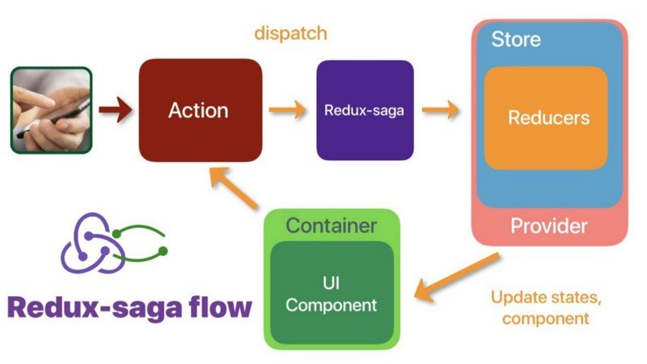

# redux-saga


## 간단 정리

- redux-saga는 액션에 대한 이벤트 리스너이다.
- saga의 이팩트 함수를 통해 task를 반환하며 saga는 task의 실행환경이 된다.

## Intro

왜 saga를 써야 할까요?  
saga는 쉽게 말해 쉽게 말해 이벤트 리스너라고 할 수 있습니다.  
액션을 모니터링하다가 액션이 발생하면 액션에 따라 자바스크립트를 실행하거나 다른 액션을 디스패치하는 등의 방식으로 동작합니다.

1. 비동기 작업을 할 때 기존 요청을 취소 처리 할 수 있습니다.
2. 특정 액션이 발생했을 때 이에 따라 다른 액션이 디스패치 되게끔 하거나 자바스크립트 코드를 실행할 수 있습니다.
3. 웹소켓을 사용하는 경우 Channel이라는 기능을 사용하여  
   더욱 효율적으로 코드관리를 할수 있습니다.
4. API 요청을 실패했을 때 재요청하는 작업을 할수 있습니다.
5. Action을 모아서 dispatch하고 싶다.
6. 다른 프레임워크, 라이브러리와 잘 어울리게 하고 싶다
7. 재사용이 가능해진다
8. 더 작은 코드로 분할할 수 있다.
9. 병렬처리
10. 동기적 구조에서 오는 테스트의 용이성
11. retry로직 구현이 쉽다.
12. 서로 다른 컴포넌트에서 N번 액션을 디스패치했을 경우 비동기로직을 실행해야하는 경우
13. dispatch되는 매개변수가 다시 순수 객체형태로 돌아간다. 이 점은 redux 미들웨어 연계시 유연함을 제공한다. thunk를 사용하면 가장 첫번째 미들웨어가 redux-thunk가 되어야하고 다른 미들웨어를 redux-thunk앞에 배치할 수 없게 된다.

이 장점들을 종합하면 `사이드 이펙트 관리`라는 말로 정리 할 수 있습니다.  
여기서 사이드 이펙트란 순수하지 않은 함수에서 발생하는 예상 밖의 동작을 말하는데 예를 들어 비동기 작업, 브라우저 캐시등이 있습니다.  
함수가 일관된 결과를 보장하지 못하거나, 함수 외부 어디든지 조금이라도 영향을 주는 경우 모두 사이드 이펙트를 갖습니다.  
이런 사이드 이펙트에 대한 관리를 redux-saga에 몰아줌으로서 다른 부분들은 순수한 형태로 유지 할 수 있습니다.  
결과적으로 redux-saga도입하면 액션 생성자와 리듀서가 순수 함수 형태로 돌아갑니다.  
Saga의 관심은 오로지 애플리케이션의 변수로 작용 할 여지가 있는 작업(사이드 이팩트)의 관리에 있습니다.


## Redux에서 데이터 처리를 할 때 고려할 점

1. 어디서 통신처리 작성할 것인가?
2. 어디로부터 통신처리를 불러올 것인가?
3. 통신처리의 상태를 어떻게 가지게 할 것인가?  
   이 중 세번째 항목은 "loding..."메세지를 사용자에게 보여주기 위해 필요한 부분입니다.
   즉 비동기 요청의 상태를 요청,성공,실패 등의 단계로 나누어 redux 상태를 변경해야합니다.

## 용어

1. effect  
   이펙트는 사가의 미들웨어가 실행할 명령들을 포함하고 있는 평범한 자바스크립트 객체이다.

2. task  
   테스크는 백그라운드에서 실행되는 프로세스와 같다.  
   리덕스 사가 기반의 애플리케이션은 여러 테스크들을 병렬로 실행시킬 수 있다. fork 함수를 통해 이러한 테스크들을 생성할 수 있다.

3. non-blocking  
   블로킹 호출은 Saga가 이펙트를 yield 하면 실행에 대한 결과를 기다렸다가 제네레이너 내부에서 다음의 명령어의 실행을 재개한다.
   논블로킹 호출은 Saga가 이펙트를 yield한 이후 바로 실행을 재개한다는 것을 의미한다.

4. watcher/worker

- watcher: 디스패치된(dispatched) 액션을 관찰하고 모든 액션에 대해 워커(worker)를 포크합니다.
- worker: 액션을 처리하고 종료합니다.

---

## Generator로 모니터링 로직 만들기

```js
function* watchGenerator() {
  console.log("모니터링 시작!");
  while (true) {
    const action = yield;
    if (action.type === "HELLO") {
      console.log("안녕하세요?");
    }
    if (action.type === "BYE") {
      console.log("안녕히가세요.");
    }
  }
}

const watch = watchGenerator();

watch.next({ type: "HELLO" });
// 안녕하세요?
watch.next({ type: "BYE" });
// 안녕히가세요
```

이런식으로 whatch함수를 만들어서 액션을 모니터링하는 로직을 만들 수 있습니다.

---

## Flow



---

## Effect

### Select

store에서 필요한 데이터를 꺼낸다

### Put

액션을 디스패치한다.

```ts
function* writePostSaga() {
  try {
    yield put({
      type: WRITE_POST_REQUEST,
      payload: post,
    });
  } catch (e) {
    console.error(e.stack);
    yield put({
      type: WRITE_POST_FAILURE,
      payload: e,
    });
  }
}
```

### Task

비동기 액션이 dispatch되는 것을 기다린다.

```js
yield take([ADD_CART, REMOVE_CART, CLEAR_CART]);
const cart = yield select(selectCart);
localStorage.setItem('cartCache', JSON.stringify(cart));
```

### call

프로미스 완료를 기다린다

### fork

다른 task를 실헹한다

```js
export function* initDeliveryAt() {
  while (true) {
    yield take(LOAD_AVAILABLE_DATES);
    yield fork(initAvailableDatesFlow);
  }
}
...
​
export function* initAvailableDatesFlow() {
  ...
}

```

### join

다른 task종료를 기다린다

### Helper Effect

saga에서 지원하는 Helper Effect에 대해서 알아보자.

```js
import { call, put } from "redux-saga/effects";

export function* fetchData(action) {
  try {
    const data = yield call(Api.fetchUser, action.payload.url);
    yield put({ type: "FETCH_SUCCEEDED", data });
  } catch (error) {
    yield put({ type: "FETCH_FAILED", error });
  }
}
```

#### taskEvery

모든 액션마다 실행된다

```js
function* takeEvery(pattern, saga, ...args) {
  const task = yield fork(function* () {
    while (true) {
      const action = yield take(pattern);
      yield fork(saga, ...args.concat(action));
    }
  });
  return task;
}
```

이 구현체에서 알 수 있듯이 takeEvery는 여려개의 saga가 동시에 fork되게 합니다.

```js
import { takeEvery } from "redux-saga/effects";

function* watchFetchData() {
  yield takeEvery("FETCH_REQUESTED", fetchData);
}
```

#### taskLatest

액션 호출시에 같은 액션이 실행 중이면 그 액션은 파기되고 마지막 호출만 실행됩니다. POST, PUT, DELETE 같은 리소스 변경 메소드에 사용합니다.
어느 순간에도 단 하나의 태스크만 실행됩니다. 마지막으로 시작된 태스크가 되겠죠.

```js
function* takeLatest(pattern, saga, ...args) {
  const task = yield fork(function* () {
    let lastTask;
    while (true) {
      const action = yield take(pattern);
      if (lastTask) yield cancel(lastTask); // cancel is no-op if the task has already terminated

      lastTask = yield fork(saga, ...args.concat(action));
    }
  });
  return task;
}
```

`takeLatest`의 구현체를 살펴보겠습니다.  
새로운 액션이 dispatch되면 자신을 제외한 이전 모든 fork된 태스크를 취소합니다.  
따라서 가장 나중의 응답만 받을 수 있습니다.

```js
import { takeLatest } from "redux-saga/effects";

function* watchFetchData() {
  yield takeLatest("FETCH_REQUESTED", fetchData);
}
```

### all

사가 함수를 동시에 실행한다.

```ts
function* rootSaga() {
  yield console.log("[SYSTEM] rootSaga created");

  yield all([fork(baseSaga), fork(editorSaga), fork(postSaga)]);
}
```

## thunk와 saga비교

> 1. saga는 액션을 모니터링한다.
> 2. saga는 action channing 상황에서 독립적인 코드를 작석할 수 있다.

### 1. 액션 모니터링

이 점을 이용하여 애플리케이션에서 발생하는 비동기요청의 에러핸들링을 공통화 할 수 있다.

thunk는함수를 dispatch하고 redux-thunk가 전달받은 함수에
diapatch와 getSate를 매개변수로 전달하여 실행한다.

```ts
export const fetchCarsThunk = () => ( dispatch, getState ) => {
    dispatch({ type: FETCH_CARS_BEGIN });
    return axios
      .get(`/cars`)
      .then(res =>
         dispatch({ type: FETCH_CARS_SUCCESS, payload: res.data })
      )
      .catch(err =>
         dispatch({ type: FETCH_CARS_FAILURE, payload: err }));
    };
}

dispatch(fetchCars());
```

```ts
export const fetchCarsSaga = function*(){

   yield put({ type: FETCH_CARS_BEGIN });
    try {
      const res =  yield axios.get(`/cars`);
      yield put({ type: FETCH_CARS_SUCCESS, payload: res.data })
    } catch (err){
      yield put({ type: FETCH_CARS_FAILURE, payload: err }));
    }
}

// {type: 'FETCH_CARS_BEGIN'}
dispatch(fetchCars.reuest());

```

### 2. 액션 체이닝

```js
// 지명으로 유저검색
const searchByLocationThunk = (id) => (dispatch) => {
  dispatch(requestSearchByLocation(id));
  axios.searchByLocation(id).then((res) => {
    const { payload, error } = res;
    if (payload && !error) {
      dispatch(successSearchByLocation(payload));
    } else {
      dispatch(failureSearchByLocation(error));
    }
  });
};

// 사용자 조회
const fetchUserThunk = (id) => (dispatch) => {
  dispatch(requestUser(id));
  axios.user(id).then((res) => {
    const { payload, error } = res;
    if (payload && !error) {
      dispatch(successUser(payload));

      // 액션 체인: 지역명으로 유저를 검색
      dispatch(searchByLocationThunk(id));
    } else {
      dispatch(failureUser(error));
    }
  });
};
```

액션 체이닝이 필요한 경우 redux-thunk에서는 위와 같은 처리가 필요하다.  
무엇보다 이 로직이 아쉬운 점은 `fetchUser`함수에서 `searchByLocation` 유저 검색을 실행한다는 점이다. 직접 연계되는 action을 dipatch해야하는 것이 thunk의 구조적 한계다.

반면 액션 발행을 감지하는 redux-saga에서는 단일책임원칙을 준수하며 완전히 코드를 분리할 수 있다.

```js
// 지명으로 유저검색
const SearchByLocationSaga = function* () {
  while (true) {
    const action = yield take(SUCCESS_USER);
    const { payload, error } = yield call(
      API.searchByLocation,
      action.payload.location
    );
    if (payload && !error) {
      yield put(successSearchByLocation(payload));
    } else {
      yield put(failureSearchByLocation(error));
    }
  }
};

// 사용자 조회
const fetchUserSaga = function* () {
  while (true) {
    const action = yield take(REQUEST_USER);
    const { payload, error } = yield call(API.user, action.payload);
    if (payload && !error) {
      yield put(successUser(payload));
    } else {
      yield put(failureUser(error));
    }
  }
};

export default function* rootSaga() {
  yield fork(fetchUserSaga);
  // 액션 체이닝
  yield fork(SearchByLocationSaga);
}
```

# REF

- [DOC-saga](https://redux-saga.js.org/docs/introduction/BeginnerTutorial.html)
- [GIT-BOOK-kor](https://mskims.github.io/redux-saga-in-korean/introduction/BeginnerTutorial.html)
- [velopert - saga](https://react.vlpt.us/redux-middleware/10-redux-saga.html)
- [TDD-saga](https://www.vobour.com/00-redux-saga-)
- [redux-saga-interview](https://survivejs.com/blog/redux-saga-interview/)
- [Redux-Saga: 사이드 이펙트 관리](https://meetup.toast.com/posts/136)
- [Redux-Saga: 제너레이터와 이펙트](https://meetup.toast.com/posts/140)
- [from-redux-thunk-to-sagas](https://medium.com/@deeepakampolu/from-redux-thunk-to-sagas-2896c0abc676#.ptlov4222)
- [thunk and saga](https://ideveloper2.tistory.com/53)
- [thunk와 saga비교해봅시다.](https://velog.io/@dongwon2/Redux-Thunk-vs-Redux-Saga%EB%A5%BC-%EB%B9%84%EA%B5%90%ED%95%B4-%EB%B4%85%EC%8B%9C%EB%8B%A4-)
- [deal-with-async-process- by-redux-saga](https://github.com/reactkr/learn-react-in-korean/blob/master/translated/deal-with-async-process-by-redux-saga.md)
- [Managing process in redux using sagas](https://jaysoo.ca/2016/01/03/managing-processes-in-redux-using-sagas/)
- [redux and middleware](https://medium.com/humanscape-tech/redux%EC%99%80-%EB%AF%B8%EB%93%A4%EC%9B%A8%EC%96%B4-thunk-saga-43bb012503e4)
- [Managing side effects in react + redux usin sagas](https://jaysoo.ca/2016/01/03/managing-processes-in-redux-using-sagas/)
- [why do we need middleware for async flow in redux](https://stackoverflow.com/questions/34570758/why-do-we-need-middleware-for-async-flow-in-redux/34599594#34599594)
- [TDD wiwh Redux-Saga](https://www.vobour.com/00-redux-saga-)
- [why-redux-saga](https://gracefullight.dev/2017/12/06/Why-redux-saga/)
