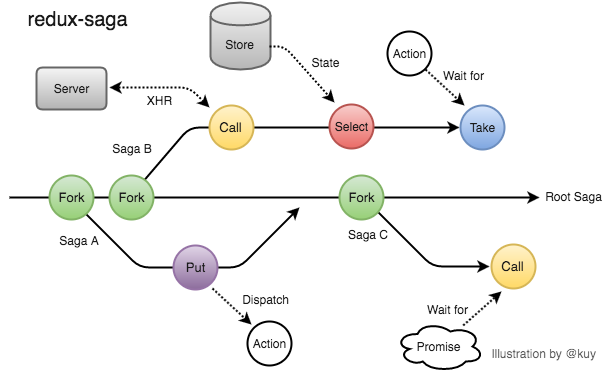

# redux-saga

## Intro
왜 saga를 써야 할까요?  
saga는 쉽게 말해 쉽게 말해 이벤트 리스너라고 할 수 있습니다.  
액션을 모니터링하다가 액션이 발생하면 액션에 따라 자바스크립트를 실행하거나 다른액션을 디스패치하는 등의 방식으로 동작합니다.  

지금 thunk를 사용하고 있더라도 saga를 써야하는 이유는 충분합니다. 
thunk에서 못했던 작업들이 가능해졌기 때문입니다.  
1. 비동기 작업을 할 때 기존 요청을 취소 처리 할 수 있습니다.
2. 특정액션이 발생 했을때 이에 따라 다른 액션이 디스패치되게끔 하거나 자바스크립트 코드를 실행할 수 잇습니다.
3. 웹소켓을 사용하는 경우 Channel이라는 기능을 사용하여 더욱 효율적으로 코드관리를 할수 있습니다.
4. API 요청을 실패했을 때 재요청하는 작업을 할수 있습니다.
5. 순차적 액션 dispatch
6. Action을 모아서 dispatch하고 싶다.
7. 다른 프레임워크, 라이브러리와 잘 어울리게 하고 싶다
8. 재사용이 가능해진다
9. 더 작은 코드로 분할할 수 있다.




## Effect
### Select
state에서 필요한 데이터를 꺼낸다


### Put
액션을 디스패치한다
### Task
비동기적으로 액션이 dispatch되는 것을 기다린다.
```js
yield take([ADD_CART, REMOVE_CART, CLEAR_CART]);
const cart = yield select(selectCart);
localStorage.setItem('cartCache', JSON.stringify(cart));
```
### call
프로미스 완료를 기다린다
### fork
다른 task를 실헹한다
```js

export function* initDeliveryAt() {
  while (true) {
    yield take(LOAD_AVAILABLE_DATES);
    yield fork(initAvailableDatesFlow);
  }
}
​
...
​
export function* initAvailableDatesFlow() {
  ...
}

```
### join 
다른 task종료를 기다린다


### taskEvery
모든 액션마다 실행된다

### taskLatest
액션 호출시에 같은 액션이 실행 중이면 그 액션은 파기되고 마지막 호출만 실행됩니다. POST, PUT, DELETE 같은 리소스 변경 메소드에 사용합니다.


## 병렬 이펙트


# ref
- [from-redux-thunk-to-sagas](https://medium.com/@deeepakampolu/from-redux-thunk-to-sagas-2896c0abc676#.ptlov4222)
- [thunk and saga](https://ideveloper2.tistory.com/53)
- [saga](https://react.vlpt.us/redux-middleware/10-redux-saga.html)
- [thunk와 saga비교해봅시다.](https://velog.io/@dongwon2/Redux-Thunk-vs-Redux-Saga%EB%A5%BC-%EB%B9%84%EA%B5%90%ED%95%B4-%EB%B4%85%EC%8B%9C%EB%8B%A4-)
- [deal-with-async-process- by-redux-saga](https://github.com/reactkr/learn-react-in-korean/blob/master/translated/deal-with-async-process-by-redux-saga.md)
- [Managing process in redux using sagas](https://jaysoo.ca/2016/01/03/managing-processes-in-redux-using-sagas/)
- [redux and middleware](https://medium.com/humanscape-tech/redux%EC%99%80-%EB%AF%B8%EB%93%A4%EC%9B%A8%EC%96%B4-thunk-saga-43bb012503e4)
- [Managing side effects in react + redux usin sagas](https://jaysoo.ca/2016/01/03/managing-processes-in-redux-using-sagas/)
- [why do we need middleware for async flow in redux](https://stackoverflow.com/questions/34570758/why-do-we-need-middleware-for-async-flow-in-redux/34599594#34599594)