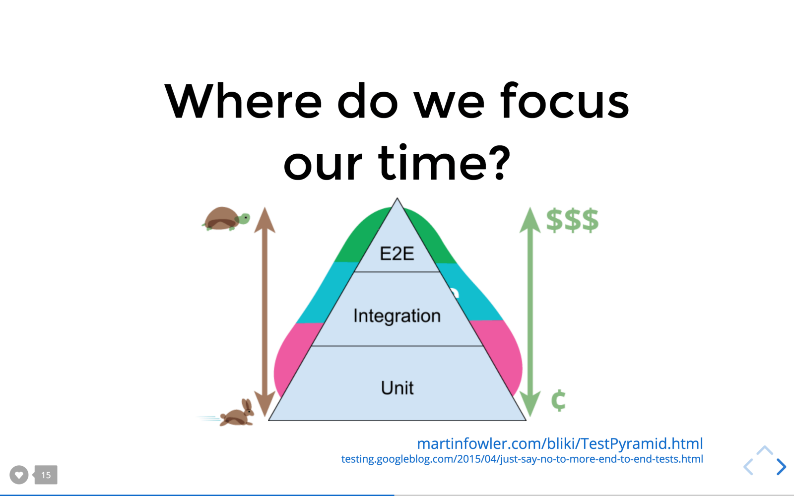
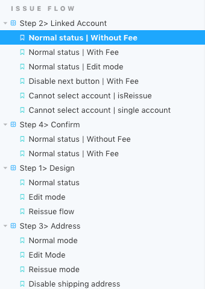

# 테스트 전략

## **intro**

이 문서는 `React` `redux` `redux-saga` 로 구성된 앱의 테스트 목적과 범위를 설명합니다.  
테스트 도구로 `Jest` `redux-saga-test-plan` `react-testing-library` 를 이용했습니다.

테스트의 범위를 정하는게 중요합니다. **테스트 커버리지를 100%로 맞추는 것을 고집할 필요가 없습니다.**
100%를 채우려다 보면 테스트 커버리지를 높히기 위한 무의미한 테스트 코드를 작성해야 합니다.

또 테스트는 정상 동작을 `추론`을 의미하기 때문에 테스트 커버리지 100%가 무결한 앱을 보장하지 않습니다.

따라서 합리적인 테스트 커버리지를 위해 _어떤 프로젝트에 어디까지 테스트를 적용할 것인가?_ 라는 질문에 대해 고민해야 합니다.

**_스토어와 미들웨어에 집중_**

저는 비지니스 로직을 한정한 단위 테스트, 통합 테스트를 테스트를 제안합니다.  
각 모듈 별 테스트 목적은 아래 설명하겠습니다.

## 테스트하기 쉬운 코드를 만들기 위해서 지켜야할 것

1. 비지니스 로직과 UI로직을 분리한다.
   - 한번에 여러가지 역할을 하는 모듈은 테스트하기 어렵다.
   - 효율적으로 테스트 범위를 정하기 위해(UI 테스트를 하지 않기 위해) 로직을 나눠 놓을 필요가 있다
2. module간 역할 분리를 세분화한다. (단일 책임)
3. 순수 함수로 작성한다.

## 좋은 테스트 코드

1. 각 테스트는 서로에게 영향을 주면 안된다.

## 셋팅

`설치`

```
$ yarn add jest @types/jest ts-jest  babel-jest -D
$ yarn add @testing-library/react @testing-library/jest-dom @testing-library/user-event -D
$ yarn add redux-saga-test-plan -D
```

`package.json`

```json
"scripts":{
	"test": "jest --detectOpenHandles --forceExit --config jest.config.js",
	"test:w": "jest --watch --detectOpenHandles --forceExit --config jest.config.js",
	"test:watch": "jest --watch --detectOpenHandles --forceExit --coverage --config jest.config.js"
}
```

`jest.config.js`

```jsx
module.exports = {
  transform: {
    "^.+\\.(ts|tsx)$": "ts-jest",
  },
  testRegex: ["\\.test\\.ts$", "\\.test\\.tsx$"],
  moduleFileExtensions: ["ts", "tsx", "js", "jsx", "json"],
  globals: {
    "ts-jest": {
      diagnostics: true,
    },
  },
  moduleNameMapper: {
    "\\.(css|less|scss|sass)$": "identity-obj-proxy",
  },
  setupFilesAfterEnv: ["<rootDir>/src/__test__/setuptests.ts"],
  // 테스트 환경을 지정합니다.
  // 기본값은 `'jsdom'`이며 브라우저와 유사한 환경을 구성합니다.
  // `'node'`를 작성하면 NodeJS와 유사한 환경을 제공할 수 있습니다.
  // jsdom의 최신 버전을 별도 사용하는 경우에는, 다음과 같이 해당 모듈을 설치 후 옵션을 지정합니다.
  testEnvironment: "jsdom",
};
```

## **테스트 범위**


- 테스트는 비지니스 로직으로 한정 지었습니다.
- 시각적 테스트(UI)는 하지 않습니다. (투자 대비 효율이 낮다고 판단)
- react- redux 앱의 경우 컨테이너 컴포넌트와 스토어의 통합 테스트까지 하는 것을 1차 목표로 잡습니다.
  (여기까지는 많은 시간이 들지 않습니다.)

### 1.단위 테스트 (Unit Test)



1-1 **비동기 액션생성자**

- 비동기 액션 생성자를 실행하면 액션이 발행(dispatch)되는가?
- 액션이 발행되면 서버 요청을 보내는가?

```jsx
import axios from "axios";
import { addTodo, ADD_TODO } from "../../src/actions";

it("should dispatch ADD_TODO action and update Server data", () => {
  jest.spyOn(axios, "put");
  const todos = [{ id: 1 }];
  const getState = () => ({ todos });
  const dispatch = jest.fn();

  const thunkAction = addTodo("Have Lunch");
  thunkAction(dispatch, getState);

  expect(dispatch).toHaveBeenCalledWith({
    type: ADD_TODO,
    text: "Have Lunch",
  });
  expect(axios.put).toHaveBeenCalledWith("/todos", todos);
});
```

1-2 **리듀서**

- 액션을 받아서 의도한 새로운 상태를 반환하는가?

```jsx
it("get card list success", () => {
  const actionPayload = [
    {
      payer_id: "1",
      card_name: "신한",
      card_number: "1234567890",
      payment: false,
    },
  ];

  cardState = cardReducer(cardState, getCardList.success(actionPayload));

  expect(cardState.cardList).toEqual(actionPayload);
});
```

1-3 미들웨어

- 액션이 미들웨어에 적용이 되는가? (라이브러리에 맡기자!)
- 미들웨어 내부에서 정상적인 흐름을 타고 있는가?
  - `redux-saga-test-plan` ([튜토리얼](https://ui.toast.com/weekly-pick/ko_20180514/))

```jsx
it("get Card List", () => {
  const req = { userId: "3" };
  const res = createServerResponce({});
  return expectSaga(cardSaga)
    .provide([[call(cardAPI.getCardList, req), res]])
    .put(startLoading(GET_CARD_LIST.REQUEST))
    .put({
      type: GET_CARD_LIST.SUCCESS,
      payload: res.data,
      meta: { header: res.header, requestData: req },
    })
    .put(finishLoading(GET_CARD_LIST.REQUEST))
    .dispatch(getCardList.request(req))
    .silentRun();
});
```

### 2. 통합 테스트(Integration Test)

- 애플리케이션에서 두 가지 이상의 요소가 함께 상호 작용할 때, 개발자가 의도한 대로 동작하는지?
- Objective: 단위 테스트 간의 연결성을 테스트
  - [통합 테스트를 해야하는 이유](https://rinae.dev/posts/write-mostly-integration-test-kr)
- `react-testing-library` 통합테스트를 지향하는 도구

  2.1 **컨테이너 컴포넌트.**

- 스토어에서 상태를 잘 조회하는가?

  2.2 **프리젠테이셔널 컴포넌트**

- 이벤트가 DOM에 잘 바인딩 되었는가?
- 이벤트를 트리거되면 컨테이너 컴포넌트로 부터 넘겨받은 함수가 실행되어 디스패치가 수행되는가
- 스토어에 값이 정상적으로 변경되었는가?
- 새로운 상태에 맞게 컴포넌트가 랜더링되었는가?

```jsx
import React from "react";
import { render, fireEvent, screen } from "../utils/testUtils";
import createStore, { history } from "../../store/configureStore";
import NavigationContainer from "../../containers/common/NavigationContainer";

describe("<NavigationContainer/>", () => {
  const store = createStore(history);
  const spyDispatch = jest.spyOn(store, "dispatch");

  test("sidebar open", () => {
    // (1) 컴포넌트 렌더링
    render(<NavigationContainer />, { store });
    // (2) 현재 사이드바의 상태가 닫혀있는 상태인지 확인
    expect(store.getState().base.slideOpen).toBe(false);
    // (3) 사이드바 메뉴중 하나를 클릭
    fireEvent.click(screen.getByTestId("home"));
    // (4) dispatch 여부 확인
    expect(spyDispatch).toHaveBeenCalledTimes(3);

    // (5) dispatch action확인
    expect(spyDispatch).toBeCalledWith({
      payload: {
        action: "POP",
        isFirstRendering: true,
        location: { hash: "", pathname: "/", search: "", state: undefined },
      },
      type: "@@router/LOCATION_CHANGE",
    });

    expect(spyDispatch).toBeCalledWith({
      type: "base/SERVER_HEALTH_CHECK_REQUEST",
    });
    expect(spyDispatch).toBeCalledWith({
      payload: true,
      type: "base/HIDE_MENUE",
    });

    // (4) store 변경상태 확인
    expect(store.getState().base.slideOpen).toBe(true);
  });

  test("sidebar close", () => {
    // (1) 컴포넌트 렌더링
    render(<NavigationContainer />, { store });
    // (2) 현재 사이드바가 열려있는지?
    expect(store.getState().base.slideOpen).toBe(true);
    // (3) 사이드바 닫기버튼 클릭
    fireEvent.click(screen.getByTestId("sidebar-close-button"));

    // (4) dispatch 닫기 요청여부 확인
    expect(spyDispatch).toBeCalledWith({
      payload: false,
      type: "base/HIDE_MENUE",
    });
    // (5) 스토어 변경상태 확인
    expect(store.getState().base.slideOpen).toBe(false);
  });
});
```

### 3.시각적(UI) 테스트

- [storybook](https://storybook.js.org/docs/react/get-started/introduction) 을 이용한 시각적 테스트 도입 예정(9월 이후)
- 자동화하기 어려운 시각적 요소는 레이아웃, 색상, 폰트, 이미지 등



_참고_

- [[Testing] 4. 컴포넌트 테스트와 검증](https://jbee.io/react/testing-4-react-testing/)

- [실용적인 프론트엔드 테스트 전략 (2) : TOAST Meetup](https://meetup.toast.com/posts/178)

### 4.E2E 테스트 (End to End Test)

- `Cypress` ([참고](https://meetup.toast.com/posts/180))
- `Selenium`
- 계획 미정, 최소한 어플은 도입해 볼 가치가 있지 않을까?

## 미해결 문제(한계)

1. 어느정도 규모의 프로젝트에 어떤 테스트 코드가 필요할까?
   - 수동 테스트와 유지보수 비용이 테스트 코드 도입 비용보다 앞지르는 시점은 언제인가?
2. reducer 테스트의 경우 서버 응답 데이터를 의존하며 응답 데이터를 mocking해서 사용한다.  
   서버 응답 포멧이 변경된 경우 테스트 코드도 변경해야한다.
3. 사용하는 도구에 따라 테스트 방법이 달라진다.
   - 리액트는 프레임 워크가 아니기 때문에 환경 셋팅에 따라 사용하는 도구가 달라진다.
   - 사용하는 라이브러리에 따라 테스트 방법이 달라질 수 있다.
4. git과 테스트 연동하기
   - 소스관리 서버에 push하기 전에 테스트 통과여부를 자동으로 확인하면 좋을 것 같다.
5. Mocking 최소화하기.
   - mocking이 많을 수록 테스트에 대한 신뢰도가 떨어진다. mocking을 최소화하기 위해선..?

## 느낀점

- 생각보다 초기 셋팅에 시간이 많이 든다. (오픈 소스의 단점)
- 테스트 코드를 작성하면서 예상 못한 버그 발견 (뜻밖의 TDD)
- 사용되지 않은 죽은 코드를 발견할 수 있었음
- 기계적으로 사용하던 React구조에 대한 심층적 이해를 돕는 계기가 됨
- 코드를 테스트하기 적합한 형태로 짜게 된다. (역할 분리)
  결합도가 높은 코드는 테스트하기 어렵기 때문에 결합도를 낮추기 위해 노력하게 된다.
- 코드 수정이 생겼을 때 에러가 생기는 부분을 바로 알 수 있다. (코드 수정 비용이 줄어든다.)

### REF

[실용적인 프론트엔드 테스트 전략 (3) : TOAST Meetup](https://meetup.toast.com/posts/180)

[[Testing] 3. Store와 비즈니스 로직 테스트](https://jbee.io/react/testing-3-react-testing/)

[How to Start Testing Your React Apps Using the React Testing Library and Jest](https://www.freecodecamp.org/news/8-simple-steps-to-start-testing-react-apps-using-react-testing-library-and-jest/)

[React Testing Library · Testing Library](https://testing-library.com/docs/react-testing-library/intro)

[테스트](https://ui.toast.com/fe-guide/ko_TEST/)

[React + Redux 앱 테스트](https://velopert.com/3591)

[[번역] 리덕스 앱을 저비용 고효율로 통합 테스트 하기](https://rinae.dev/posts/intergration-tests-in-redux-apps-kr)

[Testing React components with Jest and Enzyme | Hacker Noon](https://hackernoon.com/testing-react-components-with-jest-and-enzyme-41d592c174f)

- [벨로퍼트-리덕스앱 테스트하기](https://velopert.com/3591)
- [자바스크립트 테스트가 뭔가요](https://rinae.dev/posts/what-is-testing-javascript-kr)
- [TOAST-프론트엔드 테스트 어떻게해야하나](https://ui.toast.com/fe-guide/ko_TEST/)
