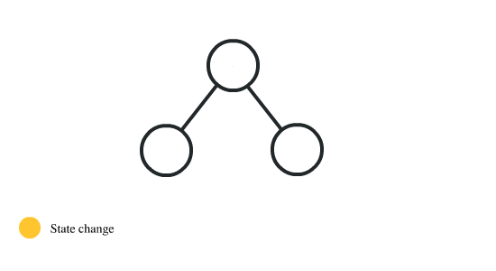
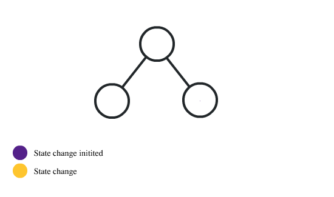
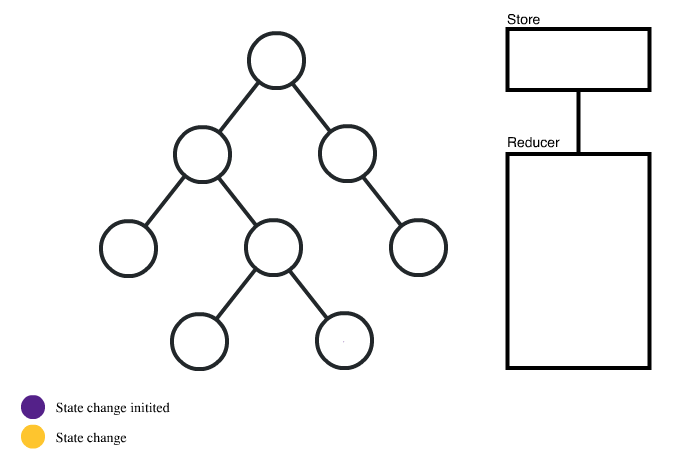

## intro

redux사용을 고려해야하는 시점,
redux가 해결해주는 문제

이 글에서는 redux에 대한 자세한 설명과 flux와 redux의 차이에 대해선 다루지 않습니다.  
상태관리 라이브러리가 필요한 이유에 대해 다룹니다.

## 1.리액트는 상태가 위에서 아래로 내려온다.

  
리액트는 상태가 위에서 아래로 내려옵니다.  
이걸 단방향 데이터흐름이라고 부릅니다.

## 2.상태 리프팅을 해야하는 시점이 온다.

  
다른 컴포넌트에 상태값을 전달하기 위해 상태 리프팅을 한 케이스입니다. 부모 컴포넌트에서 상태를 관리하고 상태 변경을 하기 위한 로직을 자식컴포넌트가 관리합니다.  
여기까지도 별 문제가 없어보입니다.

## 3. 과한 상태 리프팅은 복잡도를 증가시킨다

  
위 그림에서 알 수 있듯이 상태변경을 트리거하는 컴포넌트와
그 상태를 실질적으로 관리하는 컴포넌트 그리고 그 상태를 전달받는 컴포넌트가 나눠져있어 코드 파악이 복잡합니다.  
이럴 경우 상태 드릴링으로 인해 컴포넌트간 결합도가 생기고 코드 파악이 어려워집니다. 글로벌 상태관리에 대해 고민할 시점이 왔습니다.

이 단계에 이르었을때 이런 문제를 경험할 수 있습니다.

- 앱의 상태가 여러 컴포넌트에 걸쳐 퍼져있습니다.
- 상태 변경 로직이 여러 컴포넌트에 퍼져있습니다.
- 과도한 상태 드릴링을 유도합니다
- 디버깅을 할 때 상태 변경을 추적하기 어려워집니다.

## 4. 상태관리 라이브러리 도입

1. 컴포넌트에서 상태변경로직을 분리할 수 있습니다.
2. 컴포넌트간 결합도를 낮출 수 있습니다.
3. 상태변경을 추적하기 쉬워집니다.

### 컴포넌트간 상태변경함수 전달

상태 관리 라이브러리에서는 컴포넌트에서 직접 상태를 변경하지 않습니다. **reducer**라는 곳에서 모든 상태값의 변경을 담당합니다.

### 컴포넌트간 상태전달

각 컴포넌트는 스토어에서 상태를 조회합니다.  
그렇기 때문에 컴포넌트간 직접 상태를 전달할 필요가 없습니다.

### 관심분리의 이점

앱의 상태와 변경로직을 한 곳에서 관리하며 컴포넌트의 역할이 줄어들었습니다. 이를 통해 하나의 컴포넌트가 담당하는 기능을 더 쉽게 파악할 수 있습니다.

### 상태변경로직 테스트

상태 변경로직을 따로 관리하기 때문에 테스트를 하기 수월합니다.

## REF

- [우리가 Redux를 사용하기로 한 이유](https://medium.com/lunit/redux%EA%B0%80-%ED%95%84%EC%9A%94%ED%95%98%EB%8B%A4%EB%8A%94-%EA%B2%83%EC%9D%84-%EC%96%B8%EC%A0%9C-%EC%95%8C-%EC%88%98-%EC%9E%88%EB%82%98%EC%9A%94-426a148da64d)
