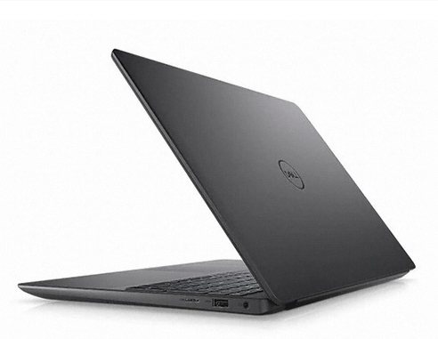
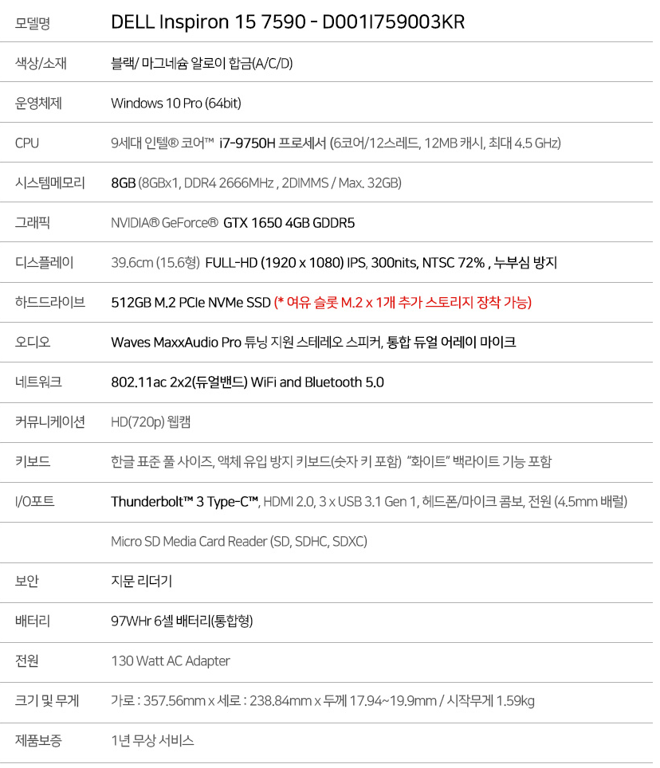

# LabTop

## Model
D001I759003KR
## 프로세서
i7-9750H 2.6GHz
## 메모리
8GB
## 무게
1.59Kg
## 두께
19.9mm

## 디스플레이
15.6` 300니트 76%색감 표현율

## 확장성
- 추가 메모리슬롯
- 추가 M.2 SSD 슬롯

## ETC
- 합급 마그네슘 하우징.
- 97WHr의 배터리 용량.
- Ubuntu 공식지원 모델.
- 슬림배젤로 15.6인치 노트북에 비해 컴팩트한 사이즈.

## 구매후기

가장 걱정스러웠던 점은 소음.  
생각보다 소음이 크지 않았지만 저전력 프로세서에 비해선 소음이 있음.  
생각만큼 하우징이 견고하다는 느낌은 받지 못함. 그냥 준수한 편
발열은 예상대로 80~90정도 찍어주고 방열작업이 필수로 필요해보임.  
소음와 발열을 감안하면서 모바일 프로세서이상의 퍼포먼스가 필요한 작업을 하시는 분들에게 추천할만한 가성비 제품.  
무엇보다 안정적인 A/S가 감동적임.

### 장점
- 안정적인 키감.
- 확실한 A/S서비스
- 타이핑시 화면이 흔들리지 않고 안정적임.
- 하이퍼포먼스 프로세서 장비중 가벼운 무게.
- 확장성
    - 내가 원하는 하드웨어를 선택적으로 구성할 수 있는 메리트.

### 단점
- 조밀한 방향키패드
- 디스플레이의 각도로 하판의 공간이 벌어지는 구조로 인해 디스플레이 각을 조절하기 어려움.
- 하이퍼포먼스 CPU를 소화하기에는 아쉬운 냉각팬.
- 방열관리가 제대로 안되어 별도의 방열작업이 필수
- 어댑터가 상당히 커서 무거운편. 95Whr 베터리 모델을 구매해서 어댑터없이 휴대하는걸 추천.
