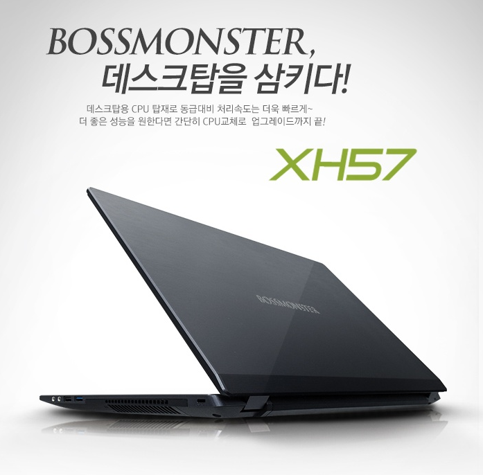
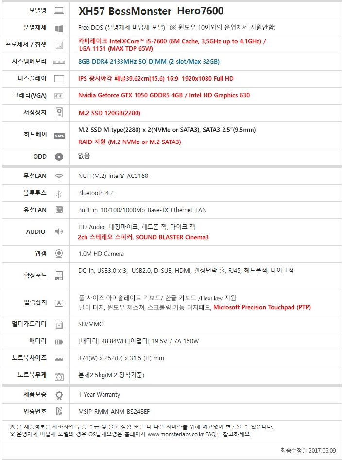

# Labtop

## 특징
- 데스크탑 프로세스를 탑재
- 쿨러 소음이 큰편
- 2.5kg의 무게와 묵직한 충전 어댑터로 휴대성이 다소 떨어짐.
- 오로지 가성비를 위한 선택
- 내장 키패드의 방향키 버튼이 큰 편이라 실용적임.

## 운영체제
Fre DOS

## 프로세스
i5-7600	  3.5GHz

## 메모리
8Gb

## 저장장치
M2 SSD 120 + 삼성evo 850 250Gb