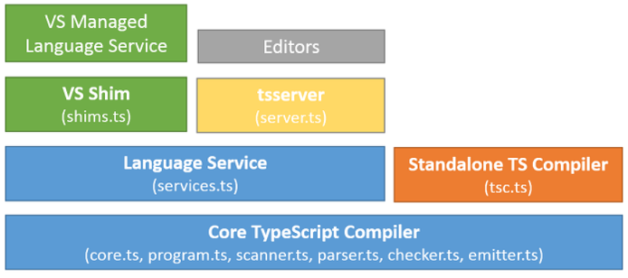

# Type Script


## intro
마이크로 소프트에서 개발하고 관리하는 오픈소스 프로그래밍 언어.  자바스크립트의 상위 집합으로 이크마 스크립트의 최신 표준을 지원합니다.

## 목표 ( TypeScript Design Goals)

### Goal
1. 오류가 될 수 있는 구조를 정적으로 식별한다.
2. 대규모 코드에 대한 구조화 메커니즘을 제공한다.
3. 배포된 프로그램에 런타임 오버해드가 발생하지 않는걸 강요합니다.
4. 깨끗하며 자연스러우며 읽기 쉬운 자바스크립트 코드
5. 작성하기 쉬우면서 이해하기 쉬운 언어를 만든다.
6. 현재와 미래의 Ecmascript의 방향감을 함께한다
7. 모든 자바스크립트 동작을 유지한다.
8. 추가적인 표현의 문법을 피한다.
9. 일관되며 완전히 지울 수 있는 구조적 타입 시스템을 사용한다.
10. 크로스 플랫폼 개발 도구가 된다.
11. 타입스크립트 1.0에서 많은 변경이 생기지 않게 한다.

### Non-Goal
1. 기존 언어 설계와 정확히 유사하게 하는 것 대신 자바스크립트의 동작과 개발자의 의도를 사용한다.
2. 적극적으로 프로그램의 런타임 성능을 최적화 하는 것 대신 런타임 플랫폼 특성에 잘 맞는 자바스크립트 코드를 제공합니다.
3. 적절하거나 올바른 타입 시스텝을 적용하게 하는 것 대신 정확성과 생산성 사이의 균형을 맞춥니다.
    - 정확성은 상대적으로 떨어질 수 있다.
    - 제대로된 프로그램이 타입검증을 통과하지 못하는 경우가 생기겨서 프로그래머가 불편함이 생기는 상황을 감안하더라도 문제가 생길 수 있는 프로그램을 최대한 잡아내는게 목표.
4. 전반적인 빌드 파이프라인을 제공하는 것 대신에 외부 도구와 컴파일러를 사용하여 보다 복잡한 빌드 워크플로우를 수행할 수 있도록 시스테 확장 가능하게 설정합니다.
5. 프로그램의 런타임 타입 정보를 추가하거나 의존하거나 타입 시스템의 결과에 따라 다른 코드를 내보내는 것 대신에 런타임 메타데이터가 필요하지 않은 프로그래밍 패턴을 권장합니다.
6. 추가적인 런타임 기능과 라이브러리를 제공하는 것 대신 타입스크립트를 사용해서 기존의 라이브러리를 작성합니다.
7. 사용자가 익숙하지 않은 새로운 패턴을 보여주는 것 대신 일반적으로 사용되는 언어에서 채택된 패턴을 고려합니다.


## 아키텍쳐



## 실행과정
타입스크립트 코드를 컴파일하여 자바스크립트 코드로 변환하며 이때 타입 검사를 수행한다.
자바스크립트 코드를 노드를 통해 실행하여 프로세스를 만든다.

## 타입 시스템
- 타입 어노테이션을 이용해서 변수에 타입을 선언할 수 있게 합니다.
- 타입 지정이 이루어지면 엄격한 타이핑이 적용되어 타입을 체크합니다.
- 컴파일 과정에서 에노테이션으로 지정한 타입을 검사하고 에노테이션을 제거하여 js파일로 변환합니다.

```ts
// type annotation
let userName: string = "cater";
```


## 장점
1. 자바스크립트와 호환성
    - 자바스크립트에타입스크립트의 기능을 선택적으로 사용 가능하다.
2. 낮은 학습비용
    - c-family 언어들과 문법적 유사성에서 오는 AltJs(자바스크립트 대체언어)에 비해 상대적으로 낮은 학습비용 
    - (etc. coffeeScript, Dart, Haxe)
3. 마이그레이션 비용 절감
    - 자바스크립트와 호환이되고 학습비용이 낮아 마그레이션에 용이하다.
    - 대다수 유명 자바스크립트 라이브러리는 타입스크립트를 지원한다.
    - 점진적 마이그레이션이 가능합니다.
4. 추가 기능을 사용할 수 있다.
    - 자바스크립트에서 지원하지 않는 기능(추상 클래스, 대수 데이텅타입,제네릭 등)이 더해지며 다른 라이브러리 사용이 불필요해진다.
    - 자바스크립트의 상위집합이라는 특징은 이런 기술을 선택적으로 사용할 수 있다는 이점을 준다. 즉 안 써도 된다.
5. 생태계 규모
    - 큰 생태계는 오픈소스의 품질과 타입스크립트 어플리케이션의 유지보수 비용을 절감으로 연결된다.
    - 타 JS컴파일 언어에 비해 지원되는 라이브러리가 풍부하다.
6. IDS 지원
    - 타입 정보를 기반으로 가지는 인텔리센스, 코드 어시스트, 타입 체크,리펙토링 등을 지원 받을 수 있다.
    - 이점은 대규모 프로젝트에서 생산성 향상에 기여한다.
    - JSDoc 정보를 이용한 타입추론
    - 3th party 라이브러리 임포트시 자동으로 타입 정의 설치
7. 보다 강력한 객체지향 프로그래밍 지원
    - 인터페이스 제네릭등 강력한 객체지향 프로그래밍 지원은 대규모 프로젝트 개발의 큰 이점이다.
8. 정적타입.
    - 정적타입언어는 시스템 복잡도가 증가하는 대규모 프로젝트에서 큰 이점을 갖는다.
    - 타입체크를 기반으로 컴파일단계에서 버그를 찾아내어 생산성에 기여한다.
    - [To type or not to type:Quantifying Detectable Bug in Javascript](http://earlbarr.com/publications/typestudy.pdf)

## 도입시 고려해볼만한점 

1. 초기 생산성이 떨어질 수도 있다.
    - 환경셋팅 시간과 팀원간 타입스크립트의 이해도에 따라 의사소통에 걸림돌이 될 수도 있다.
2. 어떤 경우에서는 잘 돌아가는 코드를 장황하게 만든다.

```ts
var a: { x: string | null } = { x: 'ok' };
window.alert = function (str: string) {
    a.x = null;
};
getFirstThreeCharsUnsafe(a);

function getFirstThreeCharsSafe(arg: { x: string | null }) {
    if (arg.x !== null) {
        window.alert('arg.x is string!');
        if (arg.x !== null) {
          console.log(arg.x.substr(0, 3));
        }
    }
}
```

- 런타임에는 약타입이라는 약점.
    - TypeGuard기능이나 io-ts fp-ts등 함수형 라이브러리를 통해 함수형으로 런타임 타이핑을 체크할수 있긶하다.
- advanced Type, Utiliy Type등 숙련되는데 시간이 걸리는 기술때문에 초기 생성성이 떨어질 수 있다.


## 기타 기업에서 타입스크립트를 도입하지 않는 이유...
1. 필요성을 못 느껴서
2. 마이그레이션 비용이 많이 들어서
3. 생산성이 떨어져서
4. 아직 생태계 발전이 충분하지 않다고 생각해서
5. flow같은 대체제에 만족하고 있어서
6. 어려워서


### 라이브러리와 호환
1. 리액트
2. 노드 서버
3. flow와 비교 
    - https://blog.rhostem.com/posts/2017-06-11-adopting-flow-and-typescript


## ref
- [](https://eng.lyft.com/typescript-at-lyft-64f0702346ea)
- [Typescript Design goals](https://github.com/Microsoft/TypeScript/wiki/TypeScript-Design-Goals)
- [타입스크립트를 시작하기전에](https://velog.io/@dongwon2/TypeScript%EB%A5%BC-%EC%8B%9C%EC%9E%91%ED%95%98%EA%B8%B0-%EC%A0%84%EC%97%90-%EC%9D%B4%EC%A0%95%EB%8F%84%EB%8A%94-%ED%95%B4%EC%A4%98%EC%95%BC%EC%A7%80)
- [Trade-offs in Control Flow Analysis](https://github.com/Microsoft/TypeScript/issues/9998) 
- [why-typescript](https://ahnheejong.gitbook.io/ts-for-jsdev/01-introducing-typescript/why-typescript)
- [타입스크립트를 무서워하지 되는 이유](https://han41858.tistory.com/14)
- [자바스크립트 개발자가 타입스크립트를 배우면 좋은이유](https://blog.eunsatio.io/develop/Javascript-%EA%B0%9C%EB%B0%9C%EC%9E%90%EA%B0%80-TypeScript%EB%A5%BC-%EB%B0%B0%EC%9A%B0%EB%A9%B4-%EC%A2%8B%EC%9D%80-%EC%9D%B4%EC%9C%A0)
- [Flow와 타입스크립트](https://blog.rhostem.com/posts/2017-06-11-adopting-flow-and-typescript)
- [우리가 타입스크립트를 채택한 이유](https://medium.com/@constell99/%EC%9A%B0%EB%A6%AC%EA%B0%80-typescript%EB%A5%BC-%EC%84%A0%ED%83%9D%ED%95%9C-%EC%9D%B4%EC%9C%A0-b0a423654f1e)
- [타입스크립트 소개와 개발환경 구축](https://poiemaweb.com/typescript-introduction)
- [달달한 제안 타입스크립트](https://jbee.io/typescript/you_might_need_typescript/) 
https://medium.com/@constell99/%EC%9A%B0%EB%A6%AC%EA%B0%80-typescript%EB%A5%BC-%EC%84%A0%ED%83%9D%ED%95%9C-%EC%9D%B4%EC%9C%A0-b0a423654f1e
https://doitnow-man.tistory.com/169